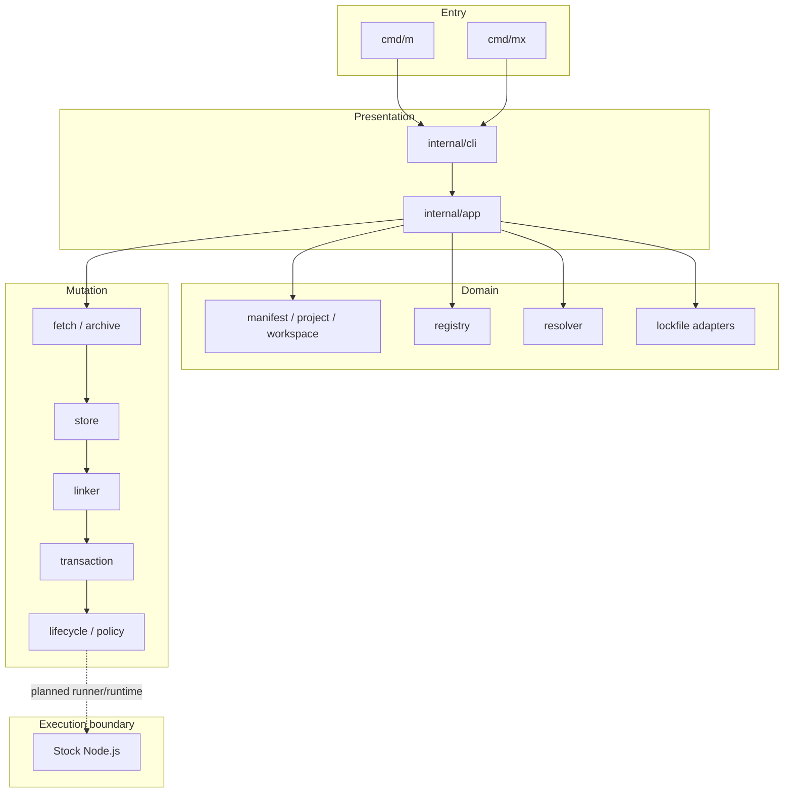

# MewJS

Go-powered JavaScript toolchain and package manager built around stock Node.js.

[](https://github.com/mewisme/mew/actions/workflows/ci.yml)
[](https://go.dev/)
[](LICENSE)

**MewJS** (abbreviated **Mew**) is a Go control plane for JavaScript projects: dependency resolution, transactional installation, lockfile bridges, supply-chain tooling, and (planned) script execution and runtime augmentation. It runs **stock Node.js** — Mew does not fork, patch, or replace Node.

The primary binary is **`m`** (product alias **`mew`**). The package executable runner is **`mx`** (alias **`mewx`**). New Mew-owned projects use the native lockfile **`m.lock`**.

> **Project status:** Active development. The package-manager core passed the MVP **0031** stabilization gate; script runners, runtime augmentation, distribution, and public releases are not yet shipped. Build from source. There are no published GitHub releases or official installers today.

## Overview

MewJS targets teams that want a single Go-native toolchain for package management, explainable dependency graphs, recoverable installs, and eventual script/runtime workflows — without maintaining a custom JavaScript runtime.

| Goal | Approach |
|---|---|
| Fast, safe package operations | Go orchestration, content-addressed store, transactional mutation |
| Incumbent compatibility | Lockfile adapters and identity detection; CLI and lockfile compatibility are separate axes |
| Observable behavior | Resolver traces, mutation plans, semantic lock diffs, typed `ERR_M_*` errors |
| Stock Node execution | Augment Node through supported loaders, preload, and environment surfaces — not a Node fork |
| Nub alignment | **Nub** is a **behavioral reference** for observable semantics; Mew is **not** a line-by-line port, does not embed Nub, and does not imply official affiliation |

Mew differs from a source-level port or custom runtime: the engine is Go-native (concurrency, storage, diagnostics), compatibility layers normalize into a shared canonical graph, and execution boundaries stay on stock Node.

## Command identity

| Command | Alias | Purpose | Current status |
|---|---|---|---|
| `m` | `mew` | Main package-manager and toolchain command | **Shipped** — PM core commands implemented and certified (MVP **0031**) |
| `mx` | `mewx` | Package executable runner | **Scaffolded** — binary builds; only `version` and `completion` today (execution: MVP **0044+**) |

**Alias installation:** `mew` / `mewx` are defined by the [naming contract](docs/naming.md). The build produces `m` and `mx` only. Installer-shipped aliases are planned for MVP **0072**. Until then, a manual rename or symlink changes the help `Use` line and version `binary` label via basename detection ([`docs/cli.md`](docs/cli.md)); aliases are not distributed automatically.

Reserved stubs on `m` (return `ERR_M_UNIMPLEMENTED` with owning MVP): `run` (**0040**), `exec` (**0043**), `init` (**0070**), `link` (**0026**).

## Project status

| Area | Status | Notes |
|---|---|---|
| Package-manager core | **Certified** | MVPs **0010–0031** complete; evidence in [`docs/core-certification.md`](docs/core-certification.md) |
| Script runner | **Planned** | Current active MVP **0040** — `m run` is a stub |
| Executable runner | **Scaffolded** | `mx` shell only; `m exec` stub (**0043**) |
| Runtime augmentation | **Planned** | MVPs **0050–0057** — TypeScript, loaders, watch, debug |
| Node and external PM management | **Planned** | MVPs **0060–0062** |
| Distribution and releases | **Planned** | MVP **0072+** — no releases, installers, or package channels yet |

Track progress: [`plans/CHECKLIST.md`](plans/CHECKLIST.md) (current MVP **0040**), roadmap [`plans/INDEX.md`](plans/INDEX.md), certification [`docs/core-certification.md`](docs/core-certification.md).

## Features available today

Capabilities below are implemented in code and covered by tests or certification fixtures. See [`features/inventory.json`](features/inventory.json) and `m features` for the full matrix.

### Dependency installation and mutation

- `m install` / `m i`, `m add`, `m remove` / `m rm`, `m update`, `m ci`
- `m dedupe`, `m prune` (extraneous `node_modules` cleanup)
- Workspace-aware `--filter` on install-family commands (requires workspaces gate)
- Hoisted and isolated (`pnpm`-style) linkers

### Project and workspace discovery

- `m project`, `m pkg` — `package.json` and workspace discovery
- Monorepo workspaces, catalogs, and filtering (MVP **0022**)

### Registry and resolution

- `m view`, `m cache`, `m registry view`
- `m resolve` with decision traces
- Offline / prefer-offline global flags

### Lockfile handling

- Native `m.lock` read, write, validate, format, migrate
- Incumbent lockfile detection and format preservation
- `m lock validate`, `m lock format`, `m lock migrate`, `m lock diff` / `m diff lock`

### Store and cache

- Global content-addressed store (`m store`)
- Registry metadata cache (`m cache`)
- Verified blob integrity (`PutVerified` / `GetVerified`)

### Transaction journals and recovery

- Atomic install-family mutations with project lock and journal v3
- `m recover`, `m rollback`, interrupted-transaction recovery
- Crash integration tests (Linux full suite; Windows sharded)

### Snapshots and rollback

- `m snapshot list`, `m snapshot restore`
- `m history` — install snapshot timeline
- Workspace member manifest capture (schema v2)

### Explainability and mutation planning

- `m explain`, `m plan`, `m plan update`
- Semantic lock diffs and resolver traces

### Audit, SBOM, provenance, and policy

- `m audit` — OSV advisory matching with `--fail-on` severity policy
- `m sbom` — CycloneDX / SPDX export
- `m verify provenance` — configured public-key verification (`TrustConfiguredKey`); fixture DSSE in tests
- `m publish --provenance` — fails closed without a configured provider
- `m policy check` — organizational supply-chain policy

### Lifecycle trust

- `m trust` / `m approve-builds` — lifecycle script trust gate
- Capability-based sandbox policy (best-effort; not full containment)

### Diagnostics, conformance, and benchmarks

- `m doctor` — project and PM health checks (lockfile, store, journals, config)
- `m features` — capability inventory (`--format table|json`, `--module`)
- `m conformance list`, `m conformance run core`
- `m bench install` / `m benchmark install` — install benchmark harness

### Advanced sources

- `m fetch`, `m pack`, `m publish`, `m patch`
- `m capsule create` / `m capsule restore` — portable verified dependency capsules

**Not available today:** `m run`, direct `m <script>` shortcuts, `m exec`, remote `mx` execution, global installs, TypeScript/runtime execution, Node version management, official binary distribution.

Command reference: [`docs/pm-commands.md`](docs/pm-commands.md).

## Installation

There are **no official binaries, installers, or GitHub releases** yet (MVP **0072**). Install by building from source.

**Prerequisites:** Go **1.26.5** or newer ([`go.mod`](go.mod)).

```powershell
git clone https://github.com/mewisme/mew.git
cd mew
$env:CGO_ENABLED = "0"
go build -o bin/m.exe ./cmd/m      # Windows
go build -o bin/mx.exe ./cmd/mx
```

```sh
git clone https://github.com/mewisme/mew.git
cd mew
CGO_ENABLED=0 go build -o bin/m ./cmd/m
CGO_ENABLED=0 go build -o bin/mx ./cmd/mx
```

Run without installing:

```powershell
$env:CGO_ENABLED = "0"
go run ./cmd/m version
go run ./cmd/mx version
```

Optional: install pinned lint tools with [`tools/install.ps1`](tools/install.ps1) or [`tools/install.sh`](tools/install.sh).

**Optional alias setup (manual):** symlink or copy `bin/m` → `mew` and `bin/mx` → `mewx` if you want basename-aware help labels. This is not an officially supported distribution channel.

## Quick start

Use discovery commands first, then a package-management workflow. Examples assume a built `m` on `PATH` or `go run ./cmd/m`.

```powershell
m --help
m version
m features --format table
m doctor
```

In an existing Node project (with `package.json`):

```powershell
m project
m doctor --json
m install
m ls
m outdated
m plan
m add lodash@^4
m plan update lodash
m explain lodash
```

`m run`, `m exec`, and `mx` package execution are **not** implemented yet — stubs return `ERR_M_UNIMPLEMENTED`.

## Lockfile compatibility

- **Greenfield Mew projects** use **`m.lock`** (`lockfileVersion: 3`).
- **Existing projects** keep incumbent lockfile **identity** when a supported adapter exists.
- **Migration** is explicit (`m lock migrate`, identity change) — Mew does not silently rewrite foreign lockfiles.
- **CLI compatibility** and **lockfile compatibility** are independent axes ([`docs/compatibility-axes.md`](docs/compatibility-axes.md)).

| Format | Detect | Read | Write | Semantic mutation | Notes |
|---|---|---|---|---|---|
| `m.lock` | Yes | Yes | Yes | Yes | Native Mew format |
| `nub.lock` | Yes | Yes | Yes | Yes | Derived-format fixture validation; no live Nub binary differential matrix |
| `pnpm-lock.yaml` | Yes | Yes | Yes | Yes | **pnpm 9, 10, 11 only** (`lockfileVersion: '9.0'`); older pnpm rejected |
| `package-lock.json` | Yes | Yes | Byte-preserving no-op | **No** | v2/v3 parse, validate, frozen install; mutation → `ERR_M_UNSUPPORTED` |
| `npm-shrinkwrap.json` | Yes | Yes | Byte-preserving no-op | **No** | Same read-only incumbent policy as `package-lock.json` |
| `yarn.lock` (Classic) | Yes | Yes | Byte-preserving no-op | **No** | Graph-changing mutation not certified |
| `yarn.lock` (Berry, `node_modules`) | Yes | Yes | Byte-preserving no-op | **No** | Graph-changing mutation not supported in MVP **0025** |
| `yarn.lock` (Berry, PnP) | Yes | Yes | **No** | **No** | Parse + identity only; PnP install rejected with typed error |
| `bun.lock` | Yes | Yes | Byte-preserving no-op | **No** | Graph-changing mutation not supported in MVP **0025** |

Details: [`docs/lockfile.md`](docs/lockfile.md), [`docs/core-certification.md`](docs/core-certification.md), [`docs/migration.md`](docs/migration.md).

## Architecture



**Rules**

- `cmd/m` and `cmd/mx` are thin entrypoints; they call `internal/cli`.
- `internal/cli` handles parsing, dispatch, help, and reporters.
- `internal/app` orchestrates cross-package workflows.
- Domain packages expose narrow interfaces; cancellable work uses `context.Context`.
- Resolution completes before filesystem mutation; mutation stages under `internal/transaction` and commits only after validation.
- Persistent formats (`m.lock`, journals, snapshots) are versioned and deterministic.
- Public failures use stable typed `ERR_M_*` codes where implemented.
- Mew does not fork or patch Node.js.

Package map: [`docs/architecture/README.md`](docs/architecture/README.md).

## Transaction model

Install-family mutations follow a staged pipeline:

```text
inspect → resolve → plan → fetch → verify → stage → validate → commit
```

On failure before commit, rollback restores the prior `package.json`, lockfile, and `node_modules` state. Journals live under `.mew/txn/<id>/`; restorable snapshots under `.mew/snapshots/`.

| Mechanism | Purpose |
|---|---|
| Project lock (`.mew/txn/lock`) | Exclusive cross-process guard with stale recovery |
| Journal v3 | Records staged artifacts and commit steps |
| `m recover` | Scans and rolls back incomplete authoritative journals |
| `m rollback` / `m snapshot restore` | Restore a prior snapshot through the same mutation session boundary |
| Crash tests | Injected interruption around staging, backup, publication, and post-commit paths |

Guarantees are **best-effort across abrupt process death** — certification evidence covers defined crash injection suites; they do not imply immunity from OS-level corruption or manual tampering. See [`docs/transaction.md`](docs/transaction.md).

## Compatibility philosophy

Every surface is classified on five axes (CLI, lockfile, config, runtime, layout) and one of four states:

| State | Meaning |
|---|---|
| **Parity** | Observable behavior matches Nub or the incumbent manager where intended |
| **Intentional divergence** | Mew differs by design (documented with rationale) |
| **Extension** | Mew-only capability (e.g. direct `m <script>` shortcuts — MVP **0042**) |
| **Deferred** | Planned but not shipped; must not be implied as available |

Mew does **not** claim universal compatibility with npm, pnpm, Yarn, Bun, or Nub. Each adapter documents its certified scope. Full matrix: [`docs/compatibility-axes.md`](docs/compatibility-axes.md).

## Security model

Verified PM-core controls (MVPs **0014**, **0021**, **0030**, **0031**):

| Area | Behavior |
|---|---|
| Integrity | Tarball digest verification before extraction when metadata provides it |
| Archive extraction | Path traversal protection, entry count/size limits, symlink policy (`internal/archive`) |
| Credentials | Redaction in errors, JSON reports, and journals ([`docs/reporters.md`](docs/reporters.md)) |
| Malformed input | Fail-closed typed errors; bounded YAML depth for pnpm locks |
| Lifecycle scripts | Trust list required; sandbox reduces reach — **not** complete containment |
| Transactions | Validation before commit; rollback on failure |
| Store integrity | Verified put/get; corrupt blob quarantine |
| `m pack` | Root containment, symlink/reparse rejection, size limits |
| Audit / SBOM / policy | OSV advisories, SPDX/CycloneDX export, org policy enforcement |
| Provenance | Configured-key verification; live Sigstore/Fulcio roots **unsupported** |
| Advisory feeds | Cached OSV bytes with digest only; cryptographic feed signing **deferred** |

Threat-model program (full product): MVP **0082**. PM-core subset: [`docs/security-pm-core.md`](docs/security-pm-core.md).

## Supported platforms

| OS | Architecture | Documented | Cross-compiled (`CGO_ENABLED=0`) | CI tested |
|---|---|---|---|---|
| Linux | amd64, arm64 | Yes | Yes | Yes (`ubuntu-latest`) |
| macOS | amd64, arm64 | Yes | Yes | Yes (`macos-latest`) |
| Windows | amd64, arm64 | Yes | Yes | Yes (`windows-latest`) |

Production binaries build with **`CGO_ENABLED=0`**. Race-detector jobs may enable CGO for the race instrument only; that is not a production dependency.

Platform-specific locking, junctions, reparse points, and crash shards are tested on native Windows — not inferred from Linux-only containers.

## Development and testing

Read [`CONTRIBUTING.md`](CONTRIBUTING.md) and [`AGENTS.md`](AGENTS.md) before product changes.

**Build and unit tests (PowerShell):**

```powershell
gofmt -w <changed-go-files>
$env:CGO_ENABLED = "0"
go test ./... -count=1
go vet ./...
go build ./cmd/m ./cmd/mx
```

**Lint, vulnerability, allowlist:**

```powershell
golangci-lint run ./...          # pinned via tools/versions.env
govulncheck ./...
go run ./tools/check-license
go run ./tools/check-deps
```

**Race (separate from no-CGO gate):**

```powershell
go test -race ./... -count=1
```

**Conformance and certification:**

```powershell
go test ./tests/conformance/... -count=1
go run ./tools/conformance/verify-fixtures
go run ./tools/ci/verify-crash-shards
go run ./cmd/m conformance run core
make core-cert    # when Make is available
```

**Fuzz smoke:** `make fuzz-smoke` or `tools/fuzz-smoke.ps1`.

**Testing layers:** unit tests in `internal/*`, integration tests in `tests/integration`, conformance fixtures in `tests/conformance`, crash-tagged integration (`-tags crash`), architecture import checks (`internal/archcheck`), fixture provenance verification (`tools/conformance/verify-fixtures`). CI workflow: [`.github/workflows/ci.yml`](.github/workflows/ci.yml).

Contributor prerequisite check (stub): `go run ./cmd/m development doctor`.

## Repository layout

| Path | Responsibility |
|---|---|
| `cmd/m/`, `cmd/mx/` | Thin binary entrypoints |
| `internal/cli/`, `internal/app/` | CLI parsing and application orchestration |
| `internal/manifest/`, `project/`, `workspace/` | Manifest and workspace discovery |
| `internal/registry/`, `resolver/`, `semver/` | Registry client and dependency resolution |
| `internal/lockfile/`, `internal/compat/` | Native and incumbent lockfile adapters |
| `internal/fetch/`, `archive/`, `store/`, `linker/` | Download, extraction, store, linking |
| `internal/transaction/`, `snapshot/`, `plan/` | Journals, snapshots, mutation planning |
| `internal/lifecycle/`, `policy/`, `advisory/`, `sbom/`, `provenance/` | Scripts, policy, supply-chain tooling |
| `internal/runner/`, `process/`, `runtime/`, `node/` | Execution scaffolding (runner/runtime planned) |
| `runtime/` | Embedded Node loader/preload assets (planned surfaces) |
| `tests/` | Integration, conformance, and crash tests |
| `fixtures/`, `testdata/` | Hermetic fixtures and golden data |
| `tools/` | CI probes, conformance verification, license/deps checks |
| `docs/` | User and engineering documentation |
| `plans/` | Canonical numbered MVP plans and checklist |
| `features/` | Machine-readable capability inventory |

Full map: [`docs/architecture/package-map.md`](docs/architecture/package-map.md).

## Roadmap

Delivery order (see [`plans/INDEX.md`](plans/INDEX.md)):

1. **Foundation** — charter, architecture, testing, CLI shell (MVPs **0001–0009**) ✓
2. **Package-manager core** — install, store, resolver, lock bridges, PM commands, security (MVPs **0010–0030**) ✓
3. **Core stabilization** — certification gate (MVP **0031**) ✓
4. **Script and executable runners** — `m run`, workspace scripts, `m exec`, `mx` (**0040–0046**) ← **active**
5. **Runtime augmentation** — stock Node launch, TypeScript, loaders, watch (**0050–0057**)
6. **Node and package-manager management** — version managers and shims (**0060–0062**)
7. **Product tooling and distribution** — init, plugins, releases, CI integrations (**0070–0074**)
8. **Compatibility, security, performance, governance** — conformance program, threat model, definition of done (**0080–0089**)

Progress rollup: [`plans/CHECKLIST.md`](plans/CHECKLIST.md). Numbered `plans/00xx-*.md` files are canonical; generated cursor plans are execution aids only.

## Contributing

1. Read [`AGENTS.md`](AGENTS.md) and confirm the active MVP in [`plans/CHECKLIST.md`](plans/CHECKLIST.md) (currently **0040**).
2. Keep changes scoped to the assigned MVP; preserve package boundaries ([`docs/architecture/forbidden-imports.md`](docs/architecture/forbidden-imports.md)).
3. Add tests and deterministic fixtures for behavior changes.
4. Update [`features/inventory.json`](features/inventory.json) and user docs for public surface changes ([`docs/features-maintenance.md`](docs/features-maintenance.md)).
5. Avoid persistent-format changes without migration planning and an ADR.
6. Preserve transaction safety and integrity guarantees on install-family paths.
7. Run focused tests, then applicable full gates before pushing ([`CONTRIBUTING.md`](CONTRIBUTING.md)).

## Known limitations

- **No stable public release** — version defaults to `0.0.0-dev`; build from source only.
- **No official installers or aliases** — Homebrew, npm, Scoop, Winget, shell installers, and GitHub releases are not available (MVP **0072**).
- **Script runner not shipped** — `m run`, direct `m <script>` shortcuts, and workspace script orchestration are planned (**0040–0042**).
- **Executable runner not shipped** — `mx` has no execution commands; `m exec` is a stub (**0043–0044**).
- **Runtime augmentation not shipped** — no TypeScript execution, custom loaders, or watch mode (**0050+**).
- **Read-only or restricted lockfile adapters** — npm/shrinkwrap semantic mutation blocked; Yarn Classic/Berry and `bun.lock` graph-changing writes unsupported; Yarn Berry PnP is read-only.
- **Nub executable conformance** — derived-format fixtures only; no frozen Nub binary differential matrix.
- **Provenance and advisories** — live Sigstore verification and cryptographic OSV feed signing are deferred.
- **Lifecycle sandbox** — trust gate and best-effort restrictions, not a complete sandbox.
- **Global installs** — not implemented (`pm.global-install` planned).
- **Bench regression CI** — advisory (`continue-on-error: true` in CI).
- **`m development doctor`** — contributor prerequisite stub; distinct from `m doctor` (PM health).

## License and acknowledgements

MewJS is released under the [MIT License](LICENSE).

**Nub** informs observable behavior and product positioning as an external behavioral reference. MewJS is an independent Go implementation — not a Rust-to-Go transliteration, not a Nub distribution, and not affiliated with the Nub project unless separately documented.

## Documentation

| Topic | Document |
|---|---|
| Charter and policy | [`docs/charter.md`](docs/charter.md) |
| Compatibility axes | [`docs/compatibility-axes.md`](docs/compatibility-axes.md) |
| PM commands | [`docs/pm-commands.md`](docs/pm-commands.md) |
| Core certification | [`docs/core-certification.md`](docs/core-certification.md) |
| Lockfiles | [`docs/lockfile.md`](docs/lockfile.md) |
| Transactions | [`docs/transaction.md`](docs/transaction.md) |
| CLI reference | [`docs/cli.md`](docs/cli.md) |
| Error codes | [`docs/errors.md`](docs/errors.md) |
| Engineering gates | [`docs/engineering.md`](docs/engineering.md) |
| Feature inventory | [`docs/features-inventory.md`](docs/features-inventory.md) |
| Contributing | [`CONTRIBUTING.md`](CONTRIBUTING.md) |
| Implementation plans | [`plans/0000-README.md`](plans/0000-README.md) |
