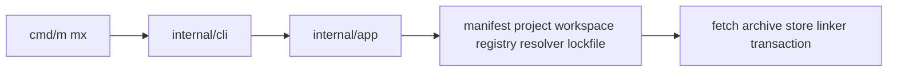

# Architecture

MewJS (Mew) is a Go control plane that augments stock Node. This directory is the
authoritative package map, dependency direction, and boundary contracts for
agents and humans.

## Documents

| Document | Purpose |
|---|---|
| [package-map.md](package-map.md) | Full directory listing with one-line purpose per path |
| [forbidden-imports.md](forbidden-imports.md) | Import edges that must never exist |
| [cli-presentation.md](cli-presentation.md) | Output modes, streams, Charm boundary, UX rollout stages |
| [interfaces.md](interfaces.md) | Core interfaces, immutability, extension points |
| [../data-model.md](../data-model.md) | Canonical graph, IDs, plan/snapshot/loss models |
| [../testing.md](../testing.md) | Fixtures, clean-home, registry, fuzz, conformance |
| [../release-train.md](../release-train.md) | MVP dependency graph, channels, stop-the-line |
| [transaction-boundary.md](transaction-boundary.md) | Install-family mutation pipeline and rollback |
| [node-augmentation.md](node-augmentation.md) | Stock-Node boundary and embedded JS rules |
| [nub-mapping.md](nub-mapping.md) | Nub crate to Mew package map |
| [transform-ipc-sketch.md](transform-ipc-sketch.md) | Transform service IPC protocol sketch |

Source contract: [`plans/0003-target-architecture.md`](../../plans/0003-target-architecture.md).

## Dependency direction

`cmd -> cli -> app`: `cmd/*` only calls into `internal/cli`, `internal/cli` owns
parsing and dispatch and builds the app context, and `internal/app` orchestrates
domain packages. `internal/app` never imports `internal/cli`.

Presentation (`cmd/*`, `internal/cli`, `internal/app`) must not own package-manager
core logic. Domain packages resolve a complete immutable graph before any
mutation. Mutation packages stage under `internal/transaction` and only commit
after validation.

## Presentation vs domain

| Layer | Packages | Owns |
|---|---|---|
| Entry | `cmd/m`, `cmd/mx` | Process exit codes only |
| Presentation | `internal/cli`, `internal/app` | Parsing, dispatch, orchestration, user output |
| Domain | `manifest`, `project`, `workspace`, `registry`, `resolver`, `lockfile` | Read/plan models |
| Mutation | `fetch`, `archive`, `store`, `linker`, `transaction` | Staged filesystem changes |
| Runtime | `runner`, `process`, `runtime`, `transform`, `node` | Execution and Node launch |

## Open decisions

- Transform IPC vs in-process only for v1 — see [transform-ipc-sketch.md](transform-ipc-sketch.md) and plan 0089.
- Whether an `internal/pm` umbrella package exists — deferred; use flat packages.
