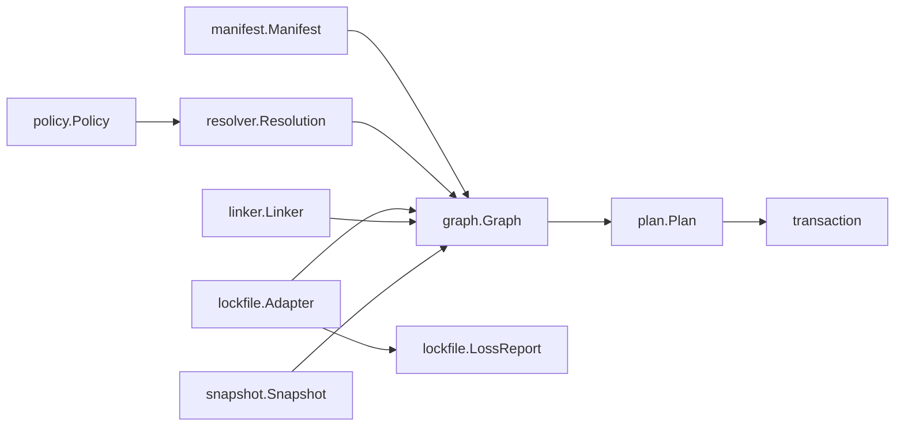

# Canonical data model

Frozen Go types shared by resolve, lockfile adapters, linker, plan, and explain
(MVP 0007). No CLI surface. Source: [`plans/0007-data-model-interfaces.md`](../plans/0007-data-model-interfaces.md).

## Ownership



| Package | Owns |
|---|---|
| `internal/graph` | `PackageID`, `ImporterID`, `PeerContext`, `Package`, `Edge`, `Importer`, `Graph` |
| `internal/manifest` | On-disk `Document` (package.json) and normalized `Manifest` / `Dependency` |
| `internal/resolver` | `Resolution`, `ResolutionDecision`, `ResolveOptions` |
| `internal/lockfile` | Adapters over `*graph.Graph`, `LossReport`, extension maps |
| `internal/linker` | `linker.Plan` (filesystem link ops only) |
| `internal/plan` | Install mutation `plan.Plan` (desired / operations / commits) |
| `internal/snapshot` | History `Snapshot` descriptors |
| `internal/policy` | Trust / sandbox `Policy` |
| `internal/capsule` | Portable `Capsule` descriptors (types only) |

`linker.Plan` and `plan.Plan` are different types. Do not confuse them.

`Document` is the text-preserving package.json model (MVP 0011). `ToNormalized`
produces the resolver-facing `Manifest`. See [`manifest.md`](manifest.md).

## Identity schemes

### ImporterID

POSIX path relative to the project root. Root importer is `.`.

### PackageID.Key()

```text
name@version
name@version#peer1@range1,peer2@range2
```

Peers are sorted by name then range before keying. Example:

- `lodash@4.17.21`
- `react@18.2.0#react-dom@^18.0.0`

Duplicate keys with divergent integrity/tarball fail validation with
`ERR_M_LOCKFILE` subject `peer-context`.

## Immutability

After `Graph.Validate()` (or builder `Build()`), treat the value as frozen.
Edits are rebuild or clone. Collections are sorted slices; encoding never
depends on Go map iteration order.

## Versioning

| Constant | Purpose |
|---|---|
| `graph.SchemaVersion` | Serialized canonical graph documents |
| `graph.CacheSchemaVersion` | Internal resolve/cache blobs only |
| `mlock.LockfileVersion` | Native `m.lock` documents (MVP 0015) |
| `plan.SchemaVersion`, `snapshot.SchemaVersion`, … | Each persistent model |

`CacheSchemaVersion` is independent of public `m.lock`. See [`lockfile.md`](lockfile.md).

## Adapter extensions and loss

Format-specific fields live in `lockfile.Extensions` (`map[string]json.RawMessage`),
never on core `graph.Package` fields. Unrepresentable round-trips emit
`lockfile.LossReport`.

## Explain / plan JSON (for 0028)

### ResolutionDecision

| Field | Type | Meaning |
|---|---|---|
| `package` | string | Requested package name |
| `requested` | string | Range or specifier |
| `candidates` | string[] | Considered versions/keys |
| `selected` | string | Chosen package key |
| `reason` | string | Why selected |
| `peerContext` | object[] | Peer constraints (`name`, `range`) |

### plan.Plan

| Field | Type | Meaning |
|---|---|---|
| `schemaVersion` | int | Plan schema |
| `desired` | object[] | Target package keys (+ integrity) |
| `operations` | object[] | `op`, `subject`, `detail` |
| `commits` | object[] | Commit-phase actions |

## Fixtures

Golden graphs under [`testdata/graph/`](../testdata/graph/):

- `simple-app.json` — root importer, two packages
- `peers.json` — peer-context package key
- `workspace.json` — multiple importers
- `loss-report.json` — adapter loss items

Golden `m.lock` files under [`testdata/lockfile/mlock/`](../testdata/lockfile/mlock/).
See [`lockfile.md`](lockfile.md).

## Integrity fields

`graph.Package` and `registry.PackageMetadata` carry `integrity` and
`tarballUrl` / `TarballURL` for resolved artifacts. Secrets never appear in
graphs, plans, snapshots, or loss reports.
