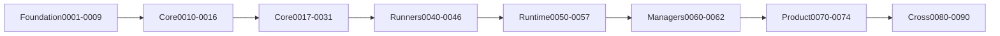

# Release train

Dependency-driven delivery order from foundation through Nub parity and Mew
extensions (MVP 0009). Sequencing is **not** calendar-based. Machine-checked
graph: [`features/milestones.json`](../features/milestones.json).

Source: [`plans/0009-release-train-overview.md`](../plans/0009-release-train-overview.md).
Versioning details (1.0 timing, frozen Node floor): plan **0084**.

## Stages

| Stage | MVPs | Gate outcome |
|---|---|---|
| Foundation | 0001–0009 | Contracts, architecture, quality gates, data models, fixtures, release sequencing |
| Core vertical slice | 0010–0016 | First usable registry-to-`node_modules` install with `m.lock` |
| Core differentiators | 0017–0030 | Transactions, store, linker, resolver, trust, workspaces, adapters, explain |
| Core stabilization | **0031** | Certification before runners/runtime depend on core |
| Runners | 0040–0045 | `m run`, workspace scheduler, shortcuts, exec, `mx` |
| Runner stabilization | **0046** | Certify execution before runtime |
| Runtime | 0050–0056 | Stock Node launch, transforms, loaders, env, watch, debug |
| Runtime stabilization | **0057** | Certify augmentation across Node matrix |
| Managers | 0060–0062 | Node manager, PM manager, shims |
| Product and distribution | 0070–0074 | Init, plugins, signed releases, Action, containers |
| Continuous certification | 0080–0089 | Conformance, performance, security, versioning, DoD |
| Future backlog | **0090** | Non-blocking; must not gate channels above |

Stabilization order (enforced in tests): **0031 → 0046 → 0057**. Runners require
0031; runtime requires 0046. Core gate 0031 must not depend on runner/runtime
MVPs. **0090** is never a required predecessor of 0031/0046/0057.

## Release channels (0.x)

Public versioning before 1.0 stays on the **0.x** line. Channel names describe
maturity, not calendar dates.

| Channel | Entry criteria | Stop-the-line |
|---|---|---|
| alpha | Foundation + core vertical slice (through 0016) compile; fixture install path exists | Integrity failure; lock corruption; credential leak |
| beta | Through **0031** core stabilization | Determinism regression on lock encode; failed recovery/rollback |
| rc | Runners + **0046** and runtime + **0057** green on OS matrix | Conformance certified-suite regression without waiver |
| stable | DoD **0087** evidence complete; installers signed | Any critical security or data-loss issue |

Stop-the-line always includes: integrity failures, lockfile corruption, credential
leaks in logs/diagnostics, silent data-loss, and unwaived conformance regressions.

## Experimental gates

- User-visible package-manager or runtime behavior that ships **before** its
  layer stabilization gate (0031 / 0046 / 0057) must use an experimental gate.
- CLI flags: `--experimental-<name>`
- Environment: `MEW_EXPERIMENTAL_<NAME>=1` (see [`naming.md`](naming.md))
- Stabilization removes the gate and updates [`compatibility-axes.md`](compatibility-axes.md)
  plus the feature inventory.

Foundation utilities already shipped without experimental gates (charter, errors,
config, inventory, testing) remain GA within 0.x.

## Public formats

1. **Readers before writers** for every public lockfile or cache format.
2. **Validate before migrate**; migrations are explicit and reported.
3. Every MVP must preserve **rollback** to the preceding stable release behavior
   for on-disk formats it owns.

## Backport and migration policy

- No calendar promises; order follows `features/milestones.json`.
- Format migrations are opt-in commands or documented major steps, never silent.
- Backports to a stable channel require the same stop-the-line bar as forward
  releases.

## Provisional support windows

Until **0084** freezes the matrix:

| Surface | Provisional rule |
|---|---|
| Node | Current Node LTS release line (document assumptions per runtime MVP) |
| Lock adapters | Read path before write path; write only after certification fixtures pass |
| OS | Linux, macOS, Windows × amd64/arm64 (arm64 may be cross-compile-only in CI) |

## Compatibility certification before GA

- Continuous conformance program: **0080**
- Global definition of done: **0087**
- Normal PR CI never depends on the public npm registry ([`testing.md`](testing.md))

## Empty-scaffold dry-run

See [`testdata/release/empty-scaffold-checklist.md`](../testdata/release/empty-scaffold-checklist.md).
