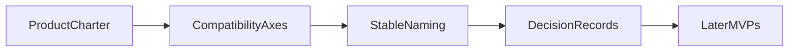

# 0001 — Program Charter and Product Contract

## Document Control

| Item | Detail |
|---|---|
| Phase | Foundation |
| Primary objective | Define Mew as a Go implementation of the Nub product model, with `m` as the primary toolchain binary and `mx` as the executable runner, while explicitly documenting Mew-specific improvements. |
| Required predecessors | None |
| Primary binaries | `m`, `mx` where applicable |
| Implementation language | Go for control plane and package-manager internals; embedded JavaScript only where Node extension APIs require it |
| Status at plan creation | Planned |

## Objective

Define Mew as a Go implementation of the Nub product model, with `m` as the primary toolchain binary and `mx` as the executable runner, while explicitly documenting Mew-specific improvements.

This MVP must be independently reviewable, testable, and releasable behind an explicit experimental gate when it changes public behavior. It must leave stable interfaces for later MVPs and avoid shortcuts that make lockfile compatibility, transactional installation, or cross-platform support impossible.

## Sequence and Dependencies

- This is a foundation document or has no hard implementation predecessor.

Work inside this MVP should normally follow this order:

1. Freeze behavior and data contracts with fixtures and interface tests.
2. Implement the smallest vertical path that reaches a user-visible result.
3. Add failure injection and cross-platform coverage before broadening features.
4. Measure performance and resource use before declaring the MVP complete.
5. Record intentional differences from Nub and from incumbent package managers.

## Nub Reference Mapping

- Nub product positioning and public command surface
- Nub MIT license and repository conventions
- Nub architecture: stock Node augmentation rather than a custom JavaScript runtime

The Nub implementation is a behavioral reference, not a source-level porting target. Mew must preserve observable semantics where parity is intentional while selecting Go-native architecture, concurrency, storage, and error-handling patterns.

## User-Visible Surface

```bash
m --version
```
```bash
mx --version
```

## In Scope

- Product identity: Mew (`m`) and Mewx (`mx`).
- Long-term goal: full intentional Nub feature parity.
- Initial delivery priority: package-manager core, then runners, runtime, managers, and distribution.
- Signature differentiators: transactional installs, rollback, explainable resolution, universal lock bridge, lifecycle sandboxing, and direct script shortcuts.
- Compatibility policy separating CLI grammar, lockfile formats, project configuration, runtime behavior, and filesystem layout.

## Explicit Non-Goals

- Do not implement features assigned to later indexed MVPs.
- Do not silently diverge from a documented compatibility contract.
- Do not optimize by weakening integrity, determinism, or crash safety.

## Architecture and Interfaces

- Create a written compatibility contract with feature states: parity, intentional divergence, extension, or deferred.
- Define supported operating systems, architectures, Node versions, and filesystem assumptions.
- Define stable naming for binaries, lockfile, config files, cache directories, environment variables, and error codes.
- Adopt a decision-record process for irreversible format and compatibility choices.

Every new package must expose narrow interfaces, accept `context.Context` for cancellable work, avoid global mutable state, and return typed errors carrying stable Mew error codes. Persistent formats must be versioned and deterministic.

## Detailed Implementation Checklist

### Contracts & types

- [ ] Write product charter covering Mew, Mewx, m.lock, and Nub parity goal
- [ ] Create compatibility-state vocabulary: parity, intentional divergence, extension, deferred
- [ ] Draft migration narrative outline for npm/pnpm/Yarn/Bun/Nub users
- [ ] Create ADR template for irreversible decisions

### Core logic

- [ ] Define compatibility axes: CLI grammar, lockfile, config, runtime, layout
- [ ] Document dispatch precedence reserved for 0042 script shortcuts
- [ ] Review charter against representative npm, pnpm, Bun, Yarn, and Nub projects
- [ ] Record open human-owned decisions with owners

### CLI / UX

- [ ] Document supported OS/arch and Node floor
- [ ] Document existing-lockfile preservation and new-project m.lock default
- [ ] Verify every later INDEX module maps to an explicit product objective

### Tests & fixtures

- [ ] Freeze binary, config, cache, env, and error-code naming conventions
- [ ] List signature Mew differentiators with owning MVP IDs
- [ ] Add charter consistency checklist used by later MVP reviews

### Docs & observability

- [ ] Document experimental-feature and versioning policy
- [ ] Draft user-facing identity strings for --version placeholders
- [ ] Publish charter in docs/ and link from README/AGENTS.md

## Test Plan

<!-- ENRICHMENT-TESTS -->
- [ ] Acceptance: Charter names m, mx, m.lock, and Nub as behavioral reference without source-port language
- [ ] Acceptance: Compatibility axes table covers CLI, lockfile, config, runtime, and layout
- [ ] Acceptance: Every INDEX MVP maps to at least one charter objective
- [ ] Acceptance: Direct script shortcuts listed as intentional Mew extension
- [ ] Acceptance: ADR process documented before any persistent format is designed
- [ ] Fixture ready: `fixtures/charter/npm-app — existing package-lock project for preservation wording`
- [ ] Fixture ready: `fixtures/charter/pnpm-app — pnpm-lock.yaml project`
- [ ] Fixture ready: `fixtures/charter/nub-app — nub.lock project`
- [ ] Fixture ready: `fixtures/charter/empty — greenfield m.lock default wording`


Required test layers:

- Unit tests for parsing, normalization, deterministic ordering, and error classification.
- Golden tests for manifests, lockfiles, command output, and migration reports.
- Integration tests against local fixture registries and isolated temporary homes.
- Failure-injection tests for network interruption, disk exhaustion, permission errors, process termination, and corrupted cache entries.
- Cross-platform tests for Linux, macOS, and Windows, including path length, case sensitivity, junctions, symlinks, and executable shims.
- Conformance tests comparing intentional compatibility surfaces with the corresponding Nub or package-manager behavior.

## Performance Requirements

- Add benchmarks for every newly introduced hot path.
- Avoid unbounded goroutines, file descriptors, memory growth, or registry requests.
- Publish baseline measurements in repository benchmark artifacts.

All performance claims must be backed by reproducible benchmark commands, machine metadata, cold/warm cache separation, and multiple samples. Performance regressions on critical paths require an explicit waiver.

## Security and Trust Requirements

- Validate all external input and fail closed on malformed or ambiguous data.
- Use least-privilege filesystem access and redact credentials in diagnostics.
- Maintain integrity verification before extraction or execution.

Secrets must never be written to logs, lockfiles, snapshots, telemetry, crash reports, or plan files. Archive extraction, script execution, registry authentication, and path construction must be treated as hostile-input boundaries.

## Risks and Mitigations

- Compatibility drift: mitigate with fixture-based conformance tests.
- Cross-platform divergence: mitigate with platform-specific CI and filesystem probes.
- Premature abstraction: require at least two concrete callers before generalizing an interface.

## Deliverables

- [ ] Production implementation and public interfaces.
- [ ] Unit, integration, conformance, and failure-injection tests.
- [ ] User documentation and migration notes where behavior is public.
- [ ] Benchmark baseline and diagnostic instrumentation.

## Exit Criteria

- [ ] All required tests pass on supported operating systems.
- [ ] No unresolved correctness, integrity, or data-loss issue remains.
- [ ] Public behavior and intentional deviations are documented.
- [ ] The next dependent MVP can consume stable interfaces without reaching into internals.


<!-- ENRICHMENT:BEGIN -->

## Feature Inventory Links

Rows this MVP owns or primarily advances (from `0002` inventory themes):

| Feature | Nub baseline | Mew target | Primary MVP |
|---|---|---|---|
| Product identity `m`/`mx` | Nub `nub`/`nubx` | Mew naming | 0001 |
| Direct script shortcuts policy | Absent in Nub | Intentional extension | 0001, 0042 |
| Lockfile preservation rule | Nub policy | Mandatory Mew policy | 0001, 0023-0025 |
| Native lockfile `m.lock` | Nub `nub.lock` | First-class Mew identity | 0001, 0015 |

## Go Package Map

**Packages / paths:**

- `docs/charter.md`
- `docs/compatibility-axes.md`
- `AGENTS.md`

**Forbidden import edges:**

- None beyond architecture rules in 0003 / AGENTS.md.

## Data Flow



## Commands and Flags

| Surface | Notes |
|---|---|
| `m --version` / `mx --version` | Identity strings only until 0010 |
| Docs-only commands | No implementation required in 0001 |

Environment: none yet. Exit codes: document reserved ranges only.

## Persistent Artifacts

| Artifact | Purpose |
|---|---|
| `docs/charter.md` | Product contract |
| `docs/compatibility-axes.md` | Parity / divergence / extension / deferred matrix |
| ADR stubs under `docs/adr/` | Irreversible format decisions |

## Concrete Test Fixtures

- `fixtures/charter/npm-app — existing package-lock project for preservation wording`
- `fixtures/charter/pnpm-app — pnpm-lock.yaml project`
- `fixtures/charter/nub-app — nub.lock project`
- `fixtures/charter/empty — greenfield m.lock default wording`

## Acceptance Scenarios

1. Charter names m, mx, m.lock, and Nub as behavioral reference without source-port language
2. Compatibility axes table covers CLI, lockfile, config, runtime, and layout
3. Every INDEX MVP maps to at least one charter objective
4. Direct script shortcuts listed as intentional Mew extension
5. ADR process documented before any persistent format is designed

## Nub Conformance Targets

- Nub product positioning — parity intent | parity
- Nub MIT/repo conventions — process only | defer
- Direct m <script> — Mew extension | extension

## Open Decisions

- Exact Node LTS floor for v1 (link 0084/0089)
- Whether github.com/mewisme/mew/mewx alias binaries ship in v1 installers

<!-- ENRICHMENT:END -->

## AI-Agent Handoff Contract

- Read 0000, 0003, 0005, 0007, 0008, and the immediate predecessor before changing code.
- Prefer small vertical pull requests over broad mechanical ports.
- Never copy Rust architecture blindly; preserve behavior and invariants using idiomatic Go.
- Update the feature matrix and conformance inventory when behavior changes.

Before submitting work, an agent must provide:

1. A concise behavior summary and the exact compatibility target.
2. A list of files and public interfaces changed.
3. Commands used for tests, benchmarks, and static analysis.
4. Known gaps, deferred cases, and platform limitations.
5. Evidence that generated files and fixtures are deterministic.
6. A rollback note for any persistent-format or migration change.
