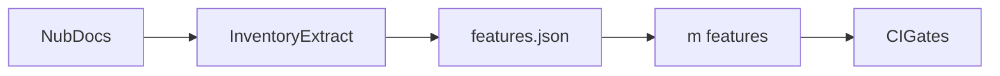

# 0002 — Complete Feature Inventory and Parity Matrix

## Document Control

| Item | Detail |
|---|---|
| Phase | Foundation |
| Primary objective | Maintain a complete, testable inventory of Nub capabilities and Mew extensions, organized by module and implementation milestone. |
| Required predecessors | 0001 |
| Primary binaries | `m`, `mx` where applicable |
| Implementation language | Go for control plane and package-manager internals; embedded JavaScript only where Node extension APIs require it |
| Status at plan creation | Planned |

## Objective

Maintain a complete, testable inventory of Nub capabilities and Mew extensions, organized by module and implementation milestone.

This MVP must be independently reviewable, testable, and releasable behind an explicit experimental gate when it changes public behavior. It must leave stable interfaces for later MVPs and avoid shortcuts that make lockfile compatibility, transactional installation, or cross-platform support impossible.

## Sequence and Dependencies

- Complete and merge 0001 before starting this MVP.

Work inside this MVP should normally follow this order:

1. Freeze behavior and data contracts with fixtures and interface tests.
2. Implement the smallest vertical path that reaches a user-visible result.
3. Add failure injection and cross-platform coverage before broadening features.
4. Measure performance and resource use before declaring the MVP complete.
5. Record intentional differences from Nub and from incumbent package managers.

## Nub Reference Mapping

- Nub CLI verbs and flags
- Nub package-manager documentation and Aube-backed behavior
- Nub runtime, watch, runner, Node manager, PM manager, shim, deployment, and plugin documentation

The Nub implementation is a behavioral reference, not a source-level porting target. Mew must preserve observable semantics where parity is intentional while selecting Go-native architecture, concurrency, storage, and error-handling patterns.

## User-Visible Surface

```bash
m features --format table
```
```bash
m features --format json
```

## In Scope

- Package manager, resolver, registry, lockfiles, store, cache, scripts, `mx`, workspaces, runtime, watch, Node manager, PM manager, shims, security, config, UX, project commands, plugins, distribution, diagnostics, and migration.
- Feature metadata: owner module, Nub status, Mew status, compatibility class, first MVP, tests, and known gaps.
- Machine-readable inventory used by documentation and conformance CI.

## Explicit Non-Goals

- Do not implement features assigned to later indexed MVPs.
- Do not silently diverge from a documented compatibility contract.
- Do not optimize by weakening integrity, determinism, or crash safety.

## Architecture and Interfaces

- Define a versioned feature-inventory schema.
- Keep source references and test identifiers outside user-facing command output.
- Generate human-readable tables from the machine-readable inventory.

Every new package must expose narrow interfaces, accept `context.Context` for cancellable work, avoid global mutable state, and return typed errors carrying stable Mew error codes. Persistent formats must be versioned and deterministic.

## Detailed Implementation Checklist

### Contracts & types

- [ ] Define versioned feature-inventory JSON schema
- [ ] Add Mew-only features from charter
- [ ] Schema validation tests
- [ ] Document how agents update inventory on behavior changes

### Core logic

- [ ] Define statuses: planned, in-progress, shipped, intentional-omit, deferred
- [ ] Assign every feature to exactly one primary MVP
- [ ] Inventory-to-command-tree consistency test (after 0010)
- [ ] Ensure every INDEX MVP owns at least one inventory row

### CLI / UX

- [ ] Define compatibility_class: parity, extension, divergence, deferred
- [ ] Link conformance test IDs where known
- [ ] Inventory-to-documentation consistency test

### Tests & fixtures

- [ ] Require fields: id, module, nub_status, mew_status, primary_mvp, tests[]
- [ ] Specify m features table and JSON output shapes
- [ ] CI fails when shipped commands are absent from inventory

### Docs & observability

- [ ] Extract all public Nub commands, flags, config keys, and documented behaviors
- [ ] Hide internal source paths from user-facing output
- [ ] Generate human-readable tables from inventory

## Test Plan

<!-- ENRICHMENT-TESTS -->
- [ ] Acceptance: Schema rejects inventory rows missing primary_mvp
- [ ] Acceptance: Every INDEX MVP owns at least one inventory row
- [ ] Acceptance: Mew extensions marked compatibility_class=extension
- [ ] Acceptance: m features --format json validates against schema
- [ ] Fixture ready: `testdata/features/minimal-inventory.json`
- [ ] Fixture ready: `testdata/features/invalid-missing-mvp.json`
- [ ] Fixture ready: `testdata/features/golden-table.txt`


Required test layers:

- Unit tests for parsing, normalization, deterministic ordering, and error classification.
- Golden tests for manifests, lockfiles, command output, and migration reports.
- Integration tests against local fixture registries and isolated temporary homes.
- Failure-injection tests for network interruption, disk exhaustion, permission errors, process termination, and corrupted cache entries.
- Cross-platform tests for Linux, macOS, and Windows, including path length, case sensitivity, junctions, symlinks, and executable shims.
- Conformance tests comparing intentional compatibility surfaces with the corresponding Nub or package-manager behavior.

## Performance Requirements

- Add benchmarks for every newly introduced hot path.
- Avoid unbounded goroutines, file descriptors, memory growth, or registry requests.
- Publish baseline measurements in repository benchmark artifacts.

All performance claims must be backed by reproducible benchmark commands, machine metadata, cold/warm cache separation, and multiple samples. Performance regressions on critical paths require an explicit waiver.

## Security and Trust Requirements

- Validate all external input and fail closed on malformed or ambiguous data.
- Use least-privilege filesystem access and redact credentials in diagnostics.
- Maintain integrity verification before extraction or execution.

Secrets must never be written to logs, lockfiles, snapshots, telemetry, crash reports, or plan files. Archive extraction, script execution, registry authentication, and path construction must be treated as hostile-input boundaries.

## Risks and Mitigations

- Compatibility drift: mitigate with fixture-based conformance tests.
- Cross-platform divergence: mitigate with platform-specific CI and filesystem probes.
- Premature abstraction: require at least two concrete callers before generalizing an interface.

## Deliverables

- [ ] Production implementation and public interfaces.
- [ ] Unit, integration, conformance, and failure-injection tests.
- [ ] User documentation and migration notes where behavior is public.
- [ ] Benchmark baseline and diagnostic instrumentation.

## Exit Criteria

- [ ] All required tests pass on supported operating systems.
- [ ] No unresolved correctness, integrity, or data-loss issue remains.
- [ ] Public behavior and intentional deviations are documented.
- [ ] The next dependent MVP can consume stable interfaces without reaching into internals.


<!-- ENRICHMENT:BEGIN -->

## Feature Inventory Links

Rows this MVP owns or primarily advances (from `0002` inventory themes):

| Feature | Nub baseline | Mew target | Primary MVP |
|---|---|---|---|
| m features table/json | Planned | Machine-readable inventory | 0002 |
| Full capability matrix | Nub surface + Mew extensions | Single inventory schema | 0002 |
| CI inventory gates | Nub conformance lists | Shipped-command coverage | 0002, 0080 |

## Go Package Map

**Packages / paths:**

- `internal/features`
- `cmd/m`
- `testdata/features`

**Forbidden import edges:**

- internal/resolver
- internal/linker
- internal/runtime

## Data Flow



## Commands and Flags

| Command | Flags | Notes |
|---|---|---|
| `m features` | `--format table\|json`, `--module`, `--status` | May be stubbed until CLI 0010 |

## Persistent Artifacts

| Artifact | Purpose |
|---|---|
| `features/inventory.schema.json` | Versioned schema |
| `features/inventory.json` | Authoritative inventory |
| Generated docs tables | Human-readable views |

## Concrete Test Fixtures

- `testdata/features/minimal-inventory.json`
- `testdata/features/invalid-missing-mvp.json`
- `testdata/features/golden-table.txt`

## Acceptance Scenarios

1. Schema rejects inventory rows missing primary_mvp
2. Every INDEX MVP owns at least one inventory row
3. Mew extensions marked compatibility_class=extension
4. m features --format json validates against schema

## Nub Conformance Targets

- Nub CLI verb inventory coverage | parity
- Mew-only features flagged | extension

## Open Decisions

- Whether inventory ships inside the binary via go:embed or remains docs-only until 0010

<!-- ENRICHMENT:END -->

## AI-Agent Handoff Contract

- Read 0000, 0003, 0005, 0007, 0008, and the immediate predecessor before changing code.
- Prefer small vertical pull requests over broad mechanical ports.
- Never copy Rust architecture blindly; preserve behavior and invariants using idiomatic Go.
- Update the feature matrix and conformance inventory when behavior changes.

Before submitting work, an agent must provide:

1. A concise behavior summary and the exact compatibility target.
2. A list of files and public interfaces changed.
3. Commands used for tests, benchmarks, and static analysis.
4. Known gaps, deferred cases, and platform limitations.
5. Evidence that generated files and fixtures are deterministic.
6. A rollback note for any persistent-format or migration change.

## Concrete Feature-to-MVP Matrix

This matrix is the initial inventory baseline. The machine-readable inventory created during implementation must preserve at least these rows and add command flags, configuration keys, tests, and certification status.

### Package-manager commands

| Feature | Nub baseline | Mew target | Primary MVP |
|---|---|---|---|
| install / i | Nub/Aube | Native transactional implementation | 0016, 0017, 0026 |
| ci / frozen clean install | Nub/Aube | Native strict implementation | 0016, 0026 |
| add / remove / update | Nub/Aube | Native transactional implementation | 0016, 0020, 0026 |
| import / dedupe / prune / rebuild | Nub/Aube | Native implementation | 0026 |
| list / why / outdated / view | Nub/Aube | Native graph and registry views | 0026, 0028 |
| fetch / pack / publish | Nub/Aube | Native implementation | 0014, 0027 |
| store / cache / config | Nub/Aube | Native implementation | 0012, 0018, 0026 |
| global installs where retained | Nub/Aube | Explicit Mew model | 0026 |

### Dependency resolver and sources

| Feature | Nub baseline | Mew target | Primary MVP |
|---|---|---|---|
| npm semver ranges and tags | Supported | Certified Go implementation | 0013 |
| transitive graph and cycles | Supported | Deterministic canonical graph | 0013 |
| peer dependencies and peer contexts | Supported | Explainable peer solver | 0020 |
| optional/dev/platform dependencies | Supported | Native policy-aware resolver | 0020 |
| overrides and resolutions | Supported | Native implementation | 0020 |
| workspace protocol and catalogs | Supported | Native implementation | 0022 |
| aliases and npm protocol | Supported | Native implementation | 0020 |
| Git, hosted Git, file, link, portal, tarball | Supported through engine | Native source adapters | 0027 |
| patch dependencies | Supported through engine | Native patch identity and application | 0027 |
| minimum release age | Supported | Recorded resolver policy | 0013, 0030 |

### Registry, download, and integrity

| Feature | Nub baseline | Mew target | Primary MVP |
|---|---|---|---|
| npm-compatible registries | Supported | Native Go HTTP client | 0012 |
| scoped and private registries | Supported | Per-origin configuration and auth | 0012 |
| proxy, custom CA, redirects, gzip | Supported | Native transport policy | 0012 |
| metadata and tarball cache | Supported | Versioned immutable cache | 0012, 0014 |
| SHA-512 SRI and legacy shasum | Supported | Fail-closed verification | 0014 |
| safe archive extraction | Supported | Hardened extraction limits | 0014 |
| offline and prefer-offline | Supported | First-class modes | 0012, 0029 |

### Lockfiles and compatibility

| Feature | Nub baseline | Mew target | Primary MVP |
|---|---|---|---|
| m.lock | Not applicable | Native read/write format | 0015 |
| nub.lock | Native Nub format | First-class read/write target | 0023 |
| pnpm lockfiles | Read/write | Per-major certified read/write | 0023 |
| package-lock and shrinkwrap | Read/write | Per-version certified read/write | 0024 |
| bun.lock | Read/write | Certified read/write | 0025 |
| Yarn Classic | Primarily read compatibility | Read first; write only if certified | 0025 |
| Yarn Berry and PnP artifacts | Active/planned capability | Staged certified read/write | 0025 |
| existing-format preservation | Core Nub behavior | Mandatory Mew behavior | 0023-0025 |
| semantic diff and validation | Limited baseline | Mew signature extension | 0028 |
| explicit lock migration and loss report | PM migration baseline | Mew signature extension | 0023-0025, 0028 |

### Install layout, store, and reliability

| Feature | Nub baseline | Mew target | Primary MVP |
|---|---|---|---|
| hoisted node_modules | Supported | Compatibility linker | 0016, 0019 |
| isolated virtual store | Supported/default model | Native default linker | 0019 |
| global content-addressed store | Supported through engine | Immutable Go store | 0018 |
| hardlink / symlink / junction behavior | Supported through engine | Cross-platform linker | 0018, 0019 |
| reflink and automatic filesystem planning | Not a primary product surface | Mew signature extension | 0018 |
| transactional install and recovery | Normal install baseline | Mew signature extension | 0017 |
| instant rollback and history | Not a core Nub surface | Mew signature extension | 0017, 0028 |
| dependency time travel | Not a core Nub surface | Mew signature extension | 0028 |
| portable capsules | Not a core Nub surface | Mew signature extension | 0029 |

### Lifecycle and supply-chain security

| Feature | Nub baseline | Mew target | Primary MVP |
|---|---|---|---|
| lifecycle scripts | Supported | Policy-controlled execution | 0021 |
| trusted dependencies / build approval | Supported | Capability-aware trust policy | 0021 |
| script sandbox | Policy baseline | Cross-platform best-effort sandbox with explicit capability report | 0021 |
| build-output cache | Engine-dependent | Verified Mew build cache | 0021 |
| audit and advisories | Package-manager feature surface | Native normalized audit | 0030 |
| SBOM | Ecosystem capability | CycloneDX and SPDX | 0030 |
| provenance and signatures | Publish/security capability | Verify and emit | 0027, 0030 |
| policy-as-code | Configuration baseline | Mew extension | 0030 |

### Workspaces and scripts

| Feature | Nub baseline | Mew target | Primary MVP |
|---|---|---|---|
| workspace discovery and graph | Supported | Shared canonical workspace graph | 0022 |
| recursive and filtered commands | Supported | Native filter engine | 0022, 0041 |
| topological and parallel script execution | Supported | Resource-bounded scheduler | 0041 |
| m run script | Supported as nub run | Native runner | 0040 |
| pre/post hooks and npm environment | Supported | Native runner | 0040 |
| reporters and NDJSON | Supported | Stable event schema | 0005, 0040 |
| direct m dev / m start shortcuts | Intentionally absent in Nub | Intentional Mew extension | 0042 |
| interactive script selection | Not required for parity | Optional Mew UX | 0042 |

### Executable runner

| Feature | Nub baseline | Mew target | Primary MVP |
|---|---|---|---|
| local package binary execution | nub exec | m exec | 0043 |
| local-first temporary execution | nubx | mx | 0044 |
| package flags and multiple packages | Supported | Supported | 0044 |
| consent and non-TTY fail-closed behavior | Supported | Supported and policy-integrated | 0044 |
| execution cache and offline mode | Supported | Native verified cache | 0044 |
| snapshot and capsule execution | Not a core Nub surface | Mew extension | 0045 |

### Runtime and watch

| Feature | Nub baseline | Mew target | Primary MVP |
|---|---|---|---|
| run JS/CJS/ESM | Supported through stock Node | Go orchestration over stock Node | 0050 |
| run TS/MTS/CTS | OXC addon and loader | Go transform service and JS loader bridge | 0051 |
| JSX/TSX | Supported | Go transform pipeline | 0052 |
| legacy and standard decorators | Supported | Certified transform stages | 0052 |
| decorator metadata | Supported | Research-gated parity | 0052, 0089 |
| tsconfig and path aliases | Supported | Native parser and loader integration | 0051, 0053 |
| source maps | Supported | Transform and stack mapping | 0052 |
| custom loaders and preloads | Supported | Loader-chain compatibility | 0053 |
| environment auto-loading | Supported | Explicit precedence implementation | 0054 |
| workers and Web Storage | Supported | Selected parity implementation | 0054 |
| watch and automatic restart | Supported | Dependency-aware supervisor | 0055 |
| debugger and inspector | Node pass-through | Node pass-through plus traces | 0056 |
| plain Node escape hatch | Supported | Mandatory compatibility path | 0050 |

### Node, package-manager, and shims

| Feature | Nub baseline | Mew target | Primary MVP |
|---|---|---|---|
| Node install/use/list/remove | Supported | Native Node manager | 0060 |
| nvmrc/node-version/engines discovery | Supported | Native precedence model | 0060 |
| automatic Node provisioning | Supported | Native verified provisioning | 0060 |
| PM detect/pin/update/migrate/cache | Supported | Native PM manager | 0061 |
| Corepack-style shims | Supported | Native safe shims | 0062 |
| Node PATH shim without augmentation | Design contract | Mandatory separation | 0062 |
| Mew self-version shim | Nub self-shim baseline | Optional verified implementation | 0062 |

### Project, plugins, and distribution

| Feature | Nub baseline | Mew target | Primary MVP |
|---|---|---|---|
| TypeScript-first init | Supported | Native scaffold | 0070 |
| template delegation through x runner | Supported guidance | mx create-* guidance | 0070 |
| external verb plugins | nub-<verb> convention | m-<verb> convention | 0071 |
| direct installers | Supported | Signed POSIX and PowerShell installers | 0072 |
| package channels | Supported across several channels | Homebrew/Scoop/Winget/npm/Nix as selected | 0072 |
| self-update | Supported | Transactional update and rollback | 0072 |
| GitHub Action | Supported | Verified setup action | 0073 |
| Docker and hosted builders | Supported | Multi-arch/rootless integration | 0074 |
