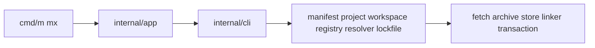

# 0003 — Target Architecture and Rust-to-Go Boundaries

## Document Control

| Item | Detail |
|---|---|
| Phase | Foundation |
| Primary objective | Define the final Go architecture, module boundaries, dependency direction, and the small embedded JavaScript surface required by Node extension APIs. |
| Required predecessors | 0001, 0002 |
| Primary binaries | `m`, `mx` where applicable |
| Implementation language | Go for control plane and package-manager internals; embedded JavaScript only where Node extension APIs require it |
| Status at plan creation | Planned |

## Objective

Define the final Go architecture, module boundaries, dependency direction, and the small embedded JavaScript surface required by Node extension APIs.

This MVP must be independently reviewable, testable, and releasable behind an explicit experimental gate when it changes public behavior. It must leave stable interfaces for later MVPs and avoid shortcuts that make lockfile compatibility, transactional installation, or cross-platform support impossible.

## Sequence and Dependencies

- Complete and merge 0001 before starting this MVP.
- Complete and merge 0002 before starting this MVP.

Work inside this MVP should normally follow this order:

1. Freeze behavior and data contracts with fixtures and interface tests.
2. Implement the smallest vertical path that reaches a user-visible result.
3. Add failure injection and cross-platform coverage before broadening features.
4. Measure performance and resource use before declaring the MVP complete.
5. Record intentional differences from Nub and from incumbent package managers.

## Nub Reference Mapping

- `crates/nub-cli` command and presentation layer
- `crates/nub-core` project, workspace, Node, and runtime support
- `vendor/aube` package-manager engine
- `crates/nub-native` OXC N-API addon
- `runtime/` preload and loader assets

The Nub implementation is a behavioral reference, not a source-level porting target. Mew must preserve observable semantics where parity is intentional while selecting Go-native architecture, concurrency, storage, and error-handling patterns.

## User-Visible Surface

No new command is required in this MVP.

## In Scope

- Go control plane and package-manager engine.
- Embedded JavaScript loaders and preloads for Node APIs that cannot execute Go directly.
- Optional local IPC transform service for synchronous Node loader hooks.
- Strict package dependency graph preventing CLI code from owning core logic.
- Persistent-store, transaction, and lockfile adapter boundaries.

## Explicit Non-Goals

- Do not implement features assigned to later indexed MVPs.
- Do not silently diverge from a documented compatibility contract.
- Do not optimize by weakening integrity, determinism, or crash safety.

## Architecture and Interfaces

- Use `cmd/m` and `cmd/mx` as thin entrypoints.
- Use `internal/app` for orchestration, `internal/pm` for package management, `internal/runner`, `internal/runtime`, `internal/node`, and `internal/compat`.
- Use pure data models between resolver, lockfile adapters, installer, and explainability recorder.
- Embed runtime assets with `go:embed`, verify their digest on extraction, and version their cache path.
- Prevent cyclic package imports through architecture tests.

Every new package must expose narrow interfaces, accept `context.Context` for cancellable work, avoid global mutable state, and return typed errors carrying stable Mew error codes. Persistent formats must be versioned and deterministic.

## Detailed Implementation Checklist

### Contracts & types

- [ ] Produce full package map with one-line purpose per directory
- [ ] Document stock-Node augmentation boundary (no libnode fork)
- [ ] Document presentation vs domain separation
- [ ] Link architecture from AGENTS.md

### Core logic

- [ ] Define core interfaces: Registry, Resolver, Store, Linker, LockfileAdapter, Transaction, ScriptRunner, ProcessSupervisor
- [ ] Document resolve-complete-before-mutate rule
- [ ] Compile-time or test-time import graph checks
- [ ] Record decisions that block later MVPs

### CLI / UX

- [ ] Decide immutability boundaries and copy-on-write points
- [ ] Map every Nub crate to Mew package or intentional omission
- [ ] Interface fakes proving independent testability
- [ ] Document embedded runtime asset digest verification and cache versioning

### Tests & fixtures

- [ ] Specify transform IPC framing, auth, cancellation sketch
- [ ] List forbidden import edges
- [ ] IPC round-trip sketch tests when protocol exists

### Docs & observability

- [ ] Define extension points without public plugin ABI
- [ ] Keep cmd/m and cmd/mx as thin entrypoints in the diagram
- [ ] Expand proposed repository tree to full listing

## Test Plan

<!-- ENRICHMENT-TESTS -->
- [ ] Acceptance: Every AGENTS.md package appears in the map
- [ ] Acceptance: No cyclic dependency in the documented graph
- [ ] Acceptance: JS surface limited to Node extension APIs
- [ ] Acceptance: Transaction boundary documented for all install-family mutations
- [ ] Fixture ready: `docs/architecture/package-map.md`
- [ ] Fixture ready: `docs/architecture/forbidden-imports.md`


Required test layers:

- Unit tests for parsing, normalization, deterministic ordering, and error classification.
- Golden tests for manifests, lockfiles, command output, and migration reports.
- Integration tests against local fixture registries and isolated temporary homes.
- Failure-injection tests for network interruption, disk exhaustion, permission errors, process termination, and corrupted cache entries.
- Cross-platform tests for Linux, macOS, and Windows, including path length, case sensitivity, junctions, symlinks, and executable shims.
- Conformance tests comparing intentional compatibility surfaces with the corresponding Nub or package-manager behavior.

## Performance Requirements

- Add benchmarks for every newly introduced hot path.
- Avoid unbounded goroutines, file descriptors, memory growth, or registry requests.
- Publish baseline measurements in repository benchmark artifacts.

All performance claims must be backed by reproducible benchmark commands, machine metadata, cold/warm cache separation, and multiple samples. Performance regressions on critical paths require an explicit waiver.

## Security and Trust Requirements

- Validate all external input and fail closed on malformed or ambiguous data.
- Use least-privilege filesystem access and redact credentials in diagnostics.
- Maintain integrity verification before extraction or execution.

Secrets must never be written to logs, lockfiles, snapshots, telemetry, crash reports, or plan files. Archive extraction, script execution, registry authentication, and path construction must be treated as hostile-input boundaries.

## Risks and Mitigations

- Compatibility drift: mitigate with fixture-based conformance tests.
- Cross-platform divergence: mitigate with platform-specific CI and filesystem probes.
- Premature abstraction: require at least two concrete callers before generalizing an interface.

## Deliverables

- [ ] Production implementation and public interfaces.
- [ ] Unit, integration, conformance, and failure-injection tests.
- [ ] User documentation and migration notes where behavior is public.
- [ ] Benchmark baseline and diagnostic instrumentation.

## Exit Criteria

- [ ] All required tests pass on supported operating systems.
- [ ] No unresolved correctness, integrity, or data-loss issue remains.
- [ ] Public behavior and intentional deviations are documented.
- [ ] The next dependent MVP can consume stable interfaces without reaching into internals.


<!-- ENRICHMENT:BEGIN -->

## Feature Inventory Links

Rows this MVP owns or primarily advances (from `0002` inventory themes):

| Feature | Nub baseline | Mew target | Primary MVP |
|---|---|---|---|
| Go control plane | Nub Rust CLI | Go packages | 0003 |
| Embedded JS loaders | Nub runtime/*.mjs | go:embed assets | 0003, 0050 |
| Transform service | nub-native OXC | Go transform + IPC | 0003, 0051 |
| Atomic mutation boundary | Aube engine | inspect→resolve→plan→fetch→verify→stage→commit | 0003, 0017 |

## Go Package Map

**Packages / paths:**

- `cmd/m`
- `cmd/mx`
- `internal/app`
- `internal/cli`
- `internal/config`
- `internal/manifest`
- `internal/project`
- `internal/workspace`
- `internal/registry`
- `internal/resolver`
- `internal/lockfile`
- `internal/fetch`
- `internal/archive`
- `internal/store`
- `internal/linker`
- `internal/transaction`
- `internal/lifecycle`
- `internal/policy`
- `internal/runner`
- `internal/process`
- `internal/runtime`
- `internal/transform`
- `internal/node`
- `internal/pmmanager`
- `internal/compat`
- `internal/testkit`
- `runtime/`

**Forbidden import edges:**

- cmd/* must not import internal implementation details beyond app/cli
- internal/cli must not import linker/resolver directly
- internal/resolver must not import linker/fetch/store

## Data Flow



## Commands and Flags

N/A — architecture document. Package import rules enforced by tests after 0004.

## Persistent Artifacts

| Artifact | Purpose |
|---|---|
| Architecture diagram in docs | Dependency direction |
| `tools/archcheck` or go test import guards | Prevent cycles |
| IPC protocol sketch for transform service | Versioned later in 0051 |

## Concrete Test Fixtures

- `docs/architecture/package-map.md`
- `docs/architecture/forbidden-imports.md`

## Acceptance Scenarios

1. Every AGENTS.md package appears in the map
2. No cyclic dependency in the documented graph
3. JS surface limited to Node extension APIs
4. Transaction boundary documented for all install-family mutations

## Nub Conformance Targets

- Nub stock-Node augmentation | parity
- OXC native addon replacement strategy | divergence

## Open Decisions

- Transform IPC vs in-process only for v1 (see 0089)
- Whether internal/pm umbrella package exists or flat packages only

<!-- ENRICHMENT:END -->

## AI-Agent Handoff Contract

- Read 0000, 0003, 0005, 0007, 0008, and the immediate predecessor before changing code.
- Prefer small vertical pull requests over broad mechanical ports.
- Never copy Rust architecture blindly; preserve behavior and invariants using idiomatic Go.
- Update the feature matrix and conformance inventory when behavior changes.

Before submitting work, an agent must provide:

1. A concise behavior summary and the exact compatibility target.
2. A list of files and public interfaces changed.
3. Commands used for tests, benchmarks, and static analysis.
4. Known gaps, deferred cases, and platform limitations.
5. Evidence that generated files and fixtures are deterministic.
6. A rollback note for any persistent-format or migration change.

## Concrete Nub-to-Mew Component Map

| Nub component | Mew target | Responsibility |
|---|---|---|
| `crates/nub-cli` | `cmd/m`, `cmd/mx`, `internal/app`, `internal/cli` | Argument parsing, dispatch, presentation, initialization, consent, and command orchestration. |
| `crates/nub-core` | `internal/project`, `internal/workspace`, `internal/process`, `internal/node`, `internal/runtime` | Project discovery, scripts, process control, Node provisioning, runtime asset management. |
| `vendor/aube/crates/aube-manifest` | `internal/manifest` | Manifest parsing, normalization, and non-destructive edits. |
| `vendor/aube/crates/aube-registry` | `internal/registry` | Registry configuration, authentication, metadata, and tarball access. |
| `vendor/aube/crates/aube-resolver` | `internal/resolver` | Semver, graph expansion, peers, optional dependencies, overrides, and decisions. |
| `vendor/aube/crates/aube-lockfile` | `internal/lockfile` plus adapters | Canonical graph conversion and lockfile compatibility. |
| `vendor/aube/crates/aube-store` | `internal/store` | Immutable content store, cache, leases, and garbage collection. |
| `vendor/aube/crates/aube-linker` | `internal/linker` | Hoisted and isolated layouts, bins, links, and filesystem planning. |
| `vendor/aube/crates/aube-scripts` | `internal/lifecycle` | Lifecycle discovery, trust, sandboxing, and build outputs. |
| `crates/nub-native` | `internal/transform` plus embedded loader bridge | Replace native OXC addon with evaluated Go transform pipeline and versioned IPC/loader protocol. |
| `runtime/*.mjs` and `runtime/*.cjs` | `internal/runtime/assets` embedded with go:embed | Rewrite and minimize Node-side hooks, preloads, PnP helpers, workers, and storage assets. |
| `crates/nub-phantom-*` | `internal/analysis/phantom` | Optional parser-backed phantom-dependency analysis after core layout stabilizes. |
| `install.sh`, `install.ps1`, npm packages, Docker, Actions | `release/`, `install/`, `.github/actions/`, `docker/` | Reproducible signed distribution and CI integration. |

## Proposed Repository Shape

Full directory listing with one-line purpose per package (authoritative for agents):

```text
cmd/m/                         # Primary CLI entrypoint binary
cmd/mx/                        # Package executor entrypoint binary
internal/app/                  # Process-level orchestration across domains
internal/cli/                  # Parsing, dispatch, help, completions
internal/config/               # Layered configuration loader
internal/diagnostics/          # Errors, progress, redaction, reporters
internal/manifest/             # package.json read/normalize/edit
internal/project/              # Project root discovery and identity
internal/workspace/            # Workspace graph, filters, catalogs
internal/registry/             # Registry clients, auth, metadata cache
internal/resolver/             # Semver + graph resolution + traces
internal/lockfile/             # Canonical graph + format adapters
internal/lockfile/mlock/       # Native m.lock codec
internal/fetch/                # Concurrent tarball download
internal/archive/              # Safe extraction and path validation
internal/store/                # Content-addressed global store
internal/linker/               # Hoisted/isolated layouts + bins
internal/linker/planner/       # hardlink/reflink/copy/symlink/junction
internal/transaction/          # Stage, journal, commit, rollback
internal/lifecycle/            # Dependency lifecycle scripts
internal/policy/               # Trust and sandbox policy
internal/runner/               # Scripts, exec, dlx environment builder
internal/process/              # Signals, shells, child execution
internal/runtime/              # Node launch orchestration
internal/runtime/assets/       # Embedded loader/preload JS
internal/transform/            # Go transform service + IPC
internal/node/                 # Node discovery and provisioning
internal/pmmanager/            # External PM detect/pin/invoke
internal/shim/                 # Cross-platform shims
internal/audit/                # Advisory normalization
internal/sbom/                 # CycloneDX/SPDX export
internal/provenance/           # Signature/provenance verify/emit
internal/capsule/              # Portable dependency capsules
internal/plugin/               # External m-<verb> discovery (no in-process load)
internal/compat/               # Nub/npm/pnpm/Yarn/Bun adapters
internal/testkit/              # Fixtures, clean-home, local registry
internal/features/             # Feature inventory schema/runtime
internal/graph/                # Shared canonical graph helpers (0007)
internal/plan/                 # Mutation plan types
internal/snapshot/             # Install history snapshots
internal/journal/              # Crash-recovery journals
assets/runtime/                # Source for go:embed runtime assets
fixtures/registry/             # Local packuments and tarballs
fixtures/projects/             # Project corpora
tests/conformance/             # Differential conformance suites
tests/integration/             # End-to-end integration suites
benchmarks/                    # Perf baselines
release/                       # Release metadata and notes
install/                       # install.sh / install.ps1 sources
.github/actions/               # GitHub Action sources
docker/                        # Container images and Dockerfiles
docs/                          # User and architecture docs
docs/adr/                      # Architecture decision records
plans/                         # This implementation archive
```

Forbidden edges (enforced after 0004):

- `cmd/*` may import only `internal/app` and `internal/cli` (plus stdlib).
- `internal/cli` must not import `resolver`, `linker`, `store`, or `fetch`.
- `internal/resolver` must not import `linker`, `transaction`, or `runner`.
- Adapters under `internal/compat` and `internal/lockfile/*` convert to/from canonical types; they do not own mutation.
