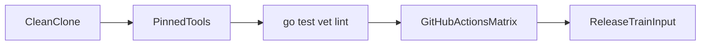

# 0004 — Repository Bootstrap, Tooling, and Engineering Standards

## Document Control

| Item | Detail |
|---|---|
| Phase | Foundation |
| Primary objective | Create a reproducible Go repository with strict quality gates, cross-platform builds, fixture management, and agent-friendly contributor guidance. |
| Required predecessors | 0003 |
| Primary binaries | `m`, `mx` where applicable |
| Implementation language | Go for control plane and package-manager internals; embedded JavaScript only where Node extension APIs require it |
| Status at plan creation | Planned |

## Objective

Create a reproducible Go repository with strict quality gates, cross-platform builds, fixture management, and agent-friendly contributor guidance.

This MVP must be independently reviewable, testable, and releasable behind an explicit experimental gate when it changes public behavior. It must leave stable interfaces for later MVPs and avoid shortcuts that make lockfile compatibility, transactional installation, or cross-platform support impossible.

## Sequence and Dependencies

- Complete and merge 0003 before starting this MVP.

Work inside this MVP should normally follow this order:

1. Freeze behavior and data contracts with fixtures and interface tests.
2. Implement the smallest vertical path that reaches a user-visible result.
3. Add failure injection and cross-platform coverage before broadening features.
4. Measure performance and resource use before declaring the MVP complete.
5. Record intentional differences from Nub and from incumbent package managers.

## Nub Reference Mapping

- Nub workspace build profiles and CI discipline
- Nub AGENTS.md orientation and compatibility rules

The Nub implementation is a behavioral reference, not a source-level porting target. Mew must preserve observable semantics where parity is intentional while selecting Go-native architecture, concurrency, storage, and error-handling patterns.

## User-Visible Surface

```bash
go test ./...
```
```bash
go vet ./...
```
```bash
m development doctor
```

## In Scope

- Go module and directory skeleton.
- Formatting, linting, testing, release, benchmark, fuzz, and fixture commands.
- AGENTS.md and architecture decision records.
- Cross-platform CI matrix and reproducible tool versions.

## Explicit Non-Goals

- Do not implement features assigned to later indexed MVPs.
- Do not silently diverge from a documented compatibility contract.
- Do not optimize by weakening integrity, determinism, or crash safety.

## Architecture and Interfaces

- Use the current supported stable Go toolchain with an explicit minimum version.
- Prefer standard library; approve dependencies through a lightweight decision record.
- Keep generated fixtures reproducible and checksum-pinned.

Every new package must expose narrow interfaces, accept `context.Context` for cancellable work, avoid global mutable state, and return typed errors carrying stable Mew error codes. Persistent formats must be versioned and deterministic.

## Detailed Implementation Checklist

### Contracts & types

- [ ] Choose Go minimum version and document it
- [ ] Create internal/testkit with temp home and fixture registry helpers
- [ ] CI self-test that fails each quality gate intentionally in a job
- [ ] Add GitHub Actions for Linux, macOS, Windows, amd64, arm64

### Core logic

- [ ] Initialize module path and license headers
- [ ] Add license and dependency allowlist checks
- [ ] Cross-platform compile matrix including Windows
- [ ] Configure race tests and fuzz smoke targets

### CLI / UX

- [ ] Define directory skeleton matching 0003
- [ ] Stub cmd/m and cmd/mx main packages compiling to --help placeholder
- [ ] Write AGENTS.md with ownership and reading order

### Tests & fixtures

- [ ] Add Makefile/task targets: test, vet, lint, race, fuzz-smoke, vuln
- [ ] Document developer doctor command contract
- [ ] Add CONTRIBUTING with exact commands

### Docs & observability

- [ ] Pin golangci-lint and govulncheck versions
- [ ] Clean-clone bootstrap test
- [ ] Document fixture checksum policy

## Test Plan

<!-- ENRICHMENT-TESTS -->
- [ ] Acceptance: Fresh clone: go test ./... passes on Linux/macOS/Windows CI
- [ ] Acceptance: Lint and vet wired in CI
- [ ] Acceptance: AGENTS.md present and linked from README
- [ ] Acceptance: cmd/m and cmd/mx build
- [ ] Fixture ready: `fixtures/bootstrap/empty-module`
- [ ] Fixture ready: `internal/testkit examples`


Required test layers:

- Unit tests for parsing, normalization, deterministic ordering, and error classification.
- Golden tests for manifests, lockfiles, command output, and migration reports.
- Integration tests against local fixture registries and isolated temporary homes.
- Failure-injection tests for network interruption, disk exhaustion, permission errors, process termination, and corrupted cache entries.
- Cross-platform tests for Linux, macOS, and Windows, including path length, case sensitivity, junctions, symlinks, and executable shims.
- Conformance tests comparing intentional compatibility surfaces with the corresponding Nub or package-manager behavior.

## Performance Requirements

- Add benchmarks for every newly introduced hot path.
- Avoid unbounded goroutines, file descriptors, memory growth, or registry requests.
- Publish baseline measurements in repository benchmark artifacts.

All performance claims must be backed by reproducible benchmark commands, machine metadata, cold/warm cache separation, and multiple samples. Performance regressions on critical paths require an explicit waiver.

## Security and Trust Requirements

- Validate all external input and fail closed on malformed or ambiguous data.
- Use least-privilege filesystem access and redact credentials in diagnostics.
- Maintain integrity verification before extraction or execution.

Secrets must never be written to logs, lockfiles, snapshots, telemetry, crash reports, or plan files. Archive extraction, script execution, registry authentication, and path construction must be treated as hostile-input boundaries.

## Risks and Mitigations

- Compatibility drift: mitigate with fixture-based conformance tests.
- Cross-platform divergence: mitigate with platform-specific CI and filesystem probes.
- Premature abstraction: require at least two concrete callers before generalizing an interface.

## Deliverables

- [ ] Production implementation and public interfaces.
- [ ] Unit, integration, conformance, and failure-injection tests.
- [ ] User documentation and migration notes where behavior is public.
- [ ] Benchmark baseline and diagnostic instrumentation.

## Exit Criteria

- [ ] All required tests pass on supported operating systems.
- [ ] No unresolved correctness, integrity, or data-loss issue remains.
- [ ] Public behavior and intentional deviations are documented.
- [ ] The next dependent MVP can consume stable interfaces without reaching into internals.


<!-- ENRICHMENT:BEGIN -->

## Feature Inventory Links

Rows this MVP owns or primarily advances (from `0002` inventory themes):

| Feature | Nub baseline | Mew target | Primary MVP |
|---|---|---|---|
| Repo bootstrap | Nub workspace CI | Go module + gates | 0004 |
| Agent guidance | Nub AGENTS.md | AGENTS.md + skills | 0004 |
| Cross-platform CI matrix | Nub profiles | Linux/macOS/Windows amd64/arm64 | 0004 |

## Go Package Map

**Packages / paths:**

- `go.mod`
- `cmd/m`
- `cmd/mx`
- `internal/testkit`
- `Makefile`
- `.github/workflows`
- `AGENTS.md`
- `tools/`

**Forbidden import edges:**

- internal/resolver
- internal/linker
- internal/fetch

## Data Flow



## Commands and Flags

| Developer command | Purpose |
|---|---|
| `make test` / `go test ./...` | Unit + integration |
| `make lint` | golangci-lint |
| `make vet` | go vet |
| `m development doctor` | Later; stub contract only |

## Persistent Artifacts

| Artifact | Purpose |
|---|---|
| `go.mod` / `go.sum` | Module identity |
| CI workflow YAMLs | Matrix builds |
| Fixture home helpers | Isolated tests |

## Concrete Test Fixtures

- `fixtures/bootstrap/empty-module`
- `internal/testkit examples`

## Acceptance Scenarios

1. Fresh clone: go test ./... passes on Linux/macOS/Windows CI
2. Lint and vet wired in CI
3. AGENTS.md present and linked from README
4. cmd/m and cmd/mx build

## Nub Conformance Targets

- Nub CI discipline — process parity | parity

## Open Decisions

- Makefile vs just vs task — pick one runner
- Module path github org/name finalization

<!-- ENRICHMENT:END -->

## AI-Agent Handoff Contract

- Read 0000, 0003, 0005, 0007, 0008, and the immediate predecessor before changing code.
- Prefer small vertical pull requests over broad mechanical ports.
- Never copy Rust architecture blindly; preserve behavior and invariants using idiomatic Go.
- Update the feature matrix and conformance inventory when behavior changes.

Before submitting work, an agent must provide:

1. A concise behavior summary and the exact compatibility target.
2. A list of files and public interfaces changed.
3. Commands used for tests, benchmarks, and static analysis.
4. Known gaps, deferred cases, and platform limitations.
5. Evidence that generated files and fixtures are deterministic.
6. A rollback note for any persistent-format or migration change.
