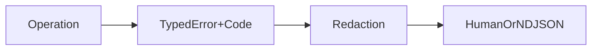

# 0005 — Stable Error Model, Diagnostics, and Observability

## Document Control

| Item | Detail |
|---|---|
| Phase | Foundation |
| Primary objective | Establish stable error codes, structured diagnostics, progress events, tracing, and redaction before implementing networked or destructive operations. |
| Required predecessors | 0004 |
| Primary binaries | `m`, `mx` where applicable |
| Implementation language | Go for control plane and package-manager internals; embedded JavaScript only where Node extension APIs require it |
| Status at plan creation | Planned |

## Objective

Establish stable error codes, structured diagnostics, progress events, tracing, and redaction before implementing networked or destructive operations.

This MVP must be independently reviewable, testable, and releasable behind an explicit experimental gate when it changes public behavior. It must leave stable interfaces for later MVPs and avoid shortcuts that make lockfile compatibility, transactional installation, or cross-platform support impossible.

## Sequence and Dependencies

- Complete and merge 0004 before starting this MVP.

Work inside this MVP should normally follow this order:

1. Freeze behavior and data contracts with fixtures and interface tests.
2. Implement the smallest vertical path that reaches a user-visible result.
3. Add failure injection and cross-platform coverage before broadening features.
4. Measure performance and resource use before declaring the MVP complete.
5. Record intentional differences from Nub and from incumbent package managers.

## Nub Reference Mapping

- Nub `ERR_NUB_*` diagnostics and Aube error presentation rewrite
- Nub human and NDJSON reporter behavior

The Nub implementation is a behavioral reference, not a source-level porting target. Mew must preserve observable semantics where parity is intentional while selecting Go-native architecture, concurrency, storage, and error-handling patterns.

## User-Visible Surface

```bash
m --reporter default ...
```
```bash
m --reporter ndjson ...
```
```bash
M_LOG=debug m ...
```

## In Scope

- Typed errors with stable `ERR_M_*` codes.
- Human, silent, JSON, and NDJSON output modes.
- Operation IDs, transaction IDs, package identities, and causal chains.
- Credential and filesystem-path redaction policy.
- Debug bundles generated only with explicit consent.

## Explicit Non-Goals

- Do not implement features assigned to later indexed MVPs.
- Do not silently diverge from a documented compatibility contract.
- Do not optimize by weakening integrity, determinism, or crash safety.

## Architecture and Interfaces

- Separate user diagnostics from internal logs.
- Represent progress as events independent of terminal rendering.
- Preserve child-process stdout and stderr semantics.
- Guarantee stable machine-readable fields within a major version.

Every new package must expose narrow interfaces, accept `context.Context` for cancellable work, avoid global mutable state, and return typed errors carrying stable Mew error codes. Persistent formats must be versioned and deterministic.

## Detailed Implementation Checklist

### Contracts & types

- [ ] Define typed error with stable code, operation, subject
- [ ] Implement human and NDJSON reporters
- [ ] Table tests for code→exit mapping
- [ ] Implement TTY detection, color policy, and width-safe rendering

### Core logic

- [ ] Publish initial error code registry
- [ ] Implement cancellation mapping to exit codes
- [ ] Redaction golden tests
- [ ] Add panic recovery at command boundaries with crash IDs

### CLI / UX

- [ ] Define progress event schema (phase, package, bytes, …)
- [ ] Add trace span hooks without mandatory OTel dependency
- [ ] Progress event golden tests

### Tests & fixtures

- [ ] Define redaction rules for URLs, tokens, headers
- [ ] Map codes to exit statuses
- [ ] Document codes for users and agents

### Docs & observability

- [ ] Implement error wrapping helpers
- [ ] Ensure secrets never print in default or debug modes without explicit unsafe flag
- [ ] Document reporter formats

## Test Plan

<!-- ENRICHMENT-TESTS -->
- [ ] Acceptance: Every public failure path yields a stable code
- [ ] Acceptance: Tokens in registry URLs are redacted in logs
- [ ] Acceptance: JSON reporter validates against schema
- [ ] Acceptance: NDJSON progress events are line-atomic under concurrency
- [ ] Fixture ready: `testdata/diagnostics/redact-cases.json`
- [ ] Fixture ready: `testdata/diagnostics/progress-golden.ndjson`
- [ ] Fixture ready: `testdata/diagnostics/error-golden.json`


Required test layers:

- Unit tests for parsing, normalization, deterministic ordering, and error classification.
- Golden tests for manifests, lockfiles, command output, and migration reports.
- Integration tests against local fixture registries and isolated temporary homes.
- Failure-injection tests for network interruption, disk exhaustion, permission errors, process termination, and corrupted cache entries.
- Cross-platform tests for Linux, macOS, and Windows, including path length, case sensitivity, junctions, symlinks, and executable shims.
- Conformance tests comparing intentional compatibility surfaces with the corresponding Nub or package-manager behavior.

## Performance Requirements

- Add benchmarks for every newly introduced hot path.
- Avoid unbounded goroutines, file descriptors, memory growth, or registry requests.
- Publish baseline measurements in repository benchmark artifacts.

All performance claims must be backed by reproducible benchmark commands, machine metadata, cold/warm cache separation, and multiple samples. Performance regressions on critical paths require an explicit waiver.

## Security and Trust Requirements

- Validate all external input and fail closed on malformed or ambiguous data.
- Use least-privilege filesystem access and redact credentials in diagnostics.
- Maintain integrity verification before extraction or execution.

Secrets must never be written to logs, lockfiles, snapshots, telemetry, crash reports, or plan files. Archive extraction, script execution, registry authentication, and path construction must be treated as hostile-input boundaries.

## Risks and Mitigations

- Compatibility drift: mitigate with fixture-based conformance tests.
- Cross-platform divergence: mitigate with platform-specific CI and filesystem probes.
- Premature abstraction: require at least two concrete callers before generalizing an interface.

## Deliverables

- [ ] Production implementation and public interfaces.
- [ ] Unit, integration, conformance, and failure-injection tests.
- [ ] User documentation and migration notes where behavior is public.
- [ ] Benchmark baseline and diagnostic instrumentation.

## Exit Criteria

- [ ] All required tests pass on supported operating systems.
- [ ] No unresolved correctness, integrity, or data-loss issue remains.
- [ ] Public behavior and intentional deviations are documented.
- [ ] The next dependent MVP can consume stable interfaces without reaching into internals.


<!-- ENRICHMENT:BEGIN -->

## Feature Inventory Links

Rows this MVP owns or primarily advances (from `0002` inventory themes):

| Feature | Nub baseline | Mew target | Primary MVP |
|---|---|---|---|
| Stable error codes | Nub diagnostics | ERR_M_* registry | 0005 |
| Progress events / NDJSON | Nub reporters | Event schema | 0005, 0040 |
| Credential redaction | Nub presentation | Fail-closed scrubbing | 0005 |

## Go Package Map

**Packages / paths:**

- `internal/diagnostics`
- `internal/apperr`
- `internal/trace`

**Forbidden import edges:**

- internal/registry
- internal/fetch
- internal/linker

## Data Flow



## Commands and Flags

| Flag / env | Purpose |
|---|---|
| `--reporter default\|ndjson` | Structured diagnostics |
| `--debug` / `M_LOG=debug` | Verbose traces |
| `--color` / `--no-color` | Presentation |

## Persistent Artifacts

| Artifact | Purpose |
|---|---|
| Error code registry doc | Stable codes |
| Event schema JSON | Progress/reporter contracts |
| `m doctor report` archive spec | Debug bundles without secrets |

## Concrete Test Fixtures

- `testdata/diagnostics/redact-cases.json`
- `testdata/diagnostics/progress-golden.ndjson`
- `testdata/diagnostics/error-golden.json`

## Acceptance Scenarios

1. Every public failure path yields a stable code
2. Tokens in registry URLs are redacted in logs
3. JSON reporter validates against schema
4. NDJSON progress events are line-atomic under concurrency

## Nub Conformance Targets

- Nub reporter concepts | parity
- Mew error code registry | extension

## Open Decisions

- Adopt OpenTelemetry optionally later vs custom spans only

<!-- ENRICHMENT:END -->

## AI-Agent Handoff Contract

- Read 0000, 0003, 0005, 0007, 0008, and the immediate predecessor before changing code.
- Prefer small vertical pull requests over broad mechanical ports.
- Never copy Rust architecture blindly; preserve behavior and invariants using idiomatic Go.
- Update the feature matrix and conformance inventory when behavior changes.

Before submitting work, an agent must provide:

1. A concise behavior summary and the exact compatibility target.
2. A list of files and public interfaces changed.
3. Commands used for tests, benchmarks, and static analysis.
4. Known gaps, deferred cases, and platform limitations.
5. Evidence that generated files and fixtures are deterministic.
6. A rollback note for any persistent-format or migration change.
