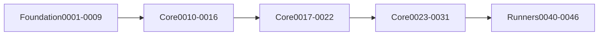
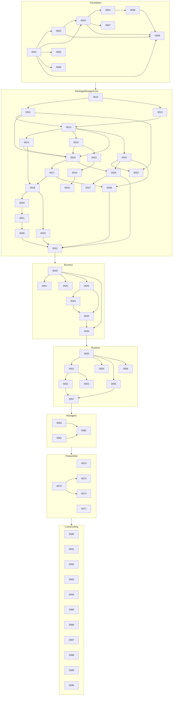

# 0009 — Release Train and MVP Dependency Graph

## Document Control

| Item | Detail |
|---|---|
| Phase | Foundation |
| Primary objective | Define the ordered delivery train from package-manager core through complete Nub parity and Mew extensions. |
| Required predecessors | 0001, 0002, 0003, 0008 |
| Primary binaries | `m`, `mx` where applicable |
| Implementation language | Go for control plane and package-manager internals; embedded JavaScript only where Node extension APIs require it |
| Status at plan creation | Planned |

## Objective

Define the ordered delivery train from package-manager core through complete Nub parity and Mew extensions.

This MVP must be independently reviewable, testable, and releasable behind an explicit experimental gate when it changes public behavior. It must leave stable interfaces for later MVPs and avoid shortcuts that make lockfile compatibility, transactional installation, or cross-platform support impossible.

## Sequence and Dependencies

- Complete and merge 0001 before starting this MVP.
- Complete and merge 0002 before starting this MVP.
- Complete and merge 0003 before starting this MVP.
- Complete and merge 0008 before starting this MVP.

Work inside this MVP should normally follow this order:

1. Freeze behavior and data contracts with fixtures and interface tests.
2. Implement the smallest vertical path that reaches a user-visible result.
3. Add failure injection and cross-platform coverage before broadening features.
4. Measure performance and resource use before declaring the MVP complete.
5. Record intentional differences from Nub and from incumbent package managers.

## Nub Reference Mapping

- Nub v0 verb surface and module layout

The Nub implementation is a behavioral reference, not a source-level porting target. Mew must preserve observable semantics where parity is intentional while selecting Go-native architecture, concurrency, storage, and error-handling patterns.

## User-Visible Surface

No new command is required in this MVP.

## In Scope

- Milestone graph and release channels.
- Feature gates and experimental flags.
- Compatibility certification gates.
- Backport and format-migration policy.

## Explicit Non-Goals

- Do not implement features assigned to later indexed MVPs.
- Do not silently diverge from a documented compatibility contract.
- Do not optimize by weakening integrity, determinism, or crash safety.

## Architecture and Interfaces

- No calendar promises; sequencing is dependency-driven.
- Every MVP must preserve rollback to the preceding stable release.
- Public formats require readers before writers and validation before migration.

Every new package must expose narrow interfaces, accept `context.Context` for cancellable work, avoid global mutable state, and return typed errors carrying stable Mew error codes. Persistent formats must be versioned and deterministic.

## Detailed Implementation Checklist

### Contracts & types

- [ ] Create milestone dependency graph with no cycles
- [ ] Map every inventory feature to a milestone
- [ ] Dry-run release checklist on empty scaffold
- [ ] No calendar promises; sequencing is dependency-driven

### Core logic

- [ ] Define alpha/beta/rc/stable criteria
- [ ] Define backport and format-migration policy
- [ ] Publish release-train doc
- [ ] Link stabilization gates 0031, 0046, 0057 to release channels

### CLI / UX

- [ ] Define which MVPs may ship experimentally
- [ ] Require readers before writers for public formats
- [ ] Keep INDEX.md synchronized
- [ ] Define compatibility certification gates before GA

### Tests & fixtures

- [ ] Define support windows for lock adapters and Node
- [ ] Document feature-flag naming for experimental commands
- [ ] Every MVP must preserve rollback to the preceding stable release

### Docs & observability

- [ ] Define stop-the-line criteria
- [ ] Validate graph has no cycles
- [ ] Public formats require validation before migration

## Test Plan

<!-- ENRICHMENT-TESTS -->
- [ ] Acceptance: Every inventory feature has a milestone
- [ ] Acceptance: Stabilization gates 0031/0046/0057 cannot start early
- [ ] Acceptance: Stop-the-line criteria include corruption and integrity failures
- [ ] Acceptance: Milestone graph has no cycles and matches INDEX.md ordering
- [ ] Fixture ready: `docs/release-train.md`
- [ ] Fixture ready: `testdata/release/empty-scaffold-checklist.md`

Required test layers:

- Unit tests for parsing, normalization, deterministic ordering, and error classification.
- Golden tests for manifests, lockfiles, command output, and migration reports.
- Integration tests against local fixture registries and isolated temporary homes.
- Failure-injection tests for network interruption, disk exhaustion, permission errors, process termination, and corrupted cache entries.
- Cross-platform tests for Linux, macOS, and Windows, including path length, case sensitivity, junctions, symlinks, and executable shims.
- Conformance tests comparing intentional compatibility surfaces with the corresponding Nub or package-manager behavior.

## Performance Requirements

- Add benchmarks for every newly introduced hot path.
- Avoid unbounded goroutines, file descriptors, memory growth, or registry requests.
- Publish baseline measurements in repository benchmark artifacts.

All performance claims must be backed by reproducible benchmark commands, machine metadata, cold/warm cache separation, and multiple samples. Performance regressions on critical paths require an explicit waiver.

## Security and Trust Requirements

- Validate all external input and fail closed on malformed or ambiguous data.
- Use least-privilege filesystem access and redact credentials in diagnostics.
- Maintain integrity verification before extraction or execution.

Secrets must never be written to logs, lockfiles, snapshots, telemetry, crash reports, or plan files. Archive extraction, script execution, registry authentication, and path construction must be treated as hostile-input boundaries.

## Risks and Mitigations

- Compatibility drift: mitigate with fixture-based conformance tests.
- Cross-platform divergence: mitigate with platform-specific CI and filesystem probes.
- Premature abstraction: require at least two concrete callers before generalizing an interface.

## Deliverables

- [ ] Production implementation and public interfaces.
- [ ] Unit, integration, conformance, and failure-injection tests.
- [ ] User documentation and migration notes where behavior is public.
- [ ] Benchmark baseline and diagnostic instrumentation.

## Exit Criteria

- [ ] All required tests pass on supported operating systems.
- [ ] No unresolved correctness, integrity, or data-loss issue remains.
- [ ] Public behavior and intentional deviations are documented.
- [ ] The next dependent MVP can consume stable interfaces without reaching into internals.

<!-- ENRICHMENT:BEGIN -->

## Feature Inventory Links

Rows this MVP owns or primarily advances (from `0002` inventory themes):

| Feature | Nub baseline | Mew target | Primary MVP |
|---|---|---|---|
| Release train | Nub modules | Ordered MVPs | 0009 |
| Experimental gates | Nub | Feature flags | 0009 |
| Stabilization gates | Nub certification | 0031/0046/0057 checkpoints | 0009 |

## Go Package Map

**Packages / paths:**

- `docs/release-train.md`
- `plans/INDEX.md`

**Forbidden import edges:**

- None beyond architecture rules in 0003 / AGENTS.md.

## Data Flow

## Commands and Flags

N/A — sequencing policy.

## Persistent Artifacts

| Artifact | Purpose |
|---|---|
| Milestone dependency graph | No cycles |
| Channel criteria | alpha/beta/rc/stable |
| Stop-the-line criteria | Corruption, security, determinism regressions |

## Concrete Test Fixtures

- `docs/release-train.md`
- `testdata/release/empty-scaffold-checklist.md`

## Acceptance Scenarios

1. Every inventory feature has a milestone
2. Stabilization gates 0031/0046/0057 cannot start early
3. Stop-the-line criteria include corruption and integrity failures
4. Milestone graph has no cycles and matches INDEX.md ordering

## Nub Conformance Targets

- Ordered delivery vs Nub module layout | divergence

## Open Decisions

- Public versioning scheme 0.x vs 1.0 timing (0084)

<!-- ENRICHMENT:END -->

## AI-Agent Handoff Contract

- Read 0000, 0003, 0005, 0007, 0008, and the immediate predecessor before changing code.
- Prefer small vertical pull requests over broad mechanical ports.
- Never copy Rust architecture blindly; preserve behavior and invariants using idiomatic Go.
- Update the feature matrix and conformance inventory when behavior changes.

Before submitting work, an agent must provide:

1. A concise behavior summary and the exact compatibility target.
2. A list of files and public interfaces changed.
3. Commands used for tests, benchmarks, and static analysis.
4. Known gaps, deferred cases, and platform limitations.
5. Evidence that generated files and fixtures are deterministic.
6. A rollback note for any persistent-format or migration change.

## Canonical Release Sequence

| Stage | Documents | Gate outcome |
|---|---|---|
| Foundation | 0001-0009 | Contracts, architecture, quality gates, data models, fixtures, and release sequencing. |
| Core vertical slice | 0010-0016 | First usable registry-to-node_modules installation with m.lock. |
| Core differentiators | 0017-0022 | Transactions, store, isolated linker, full resolver, trust, and workspaces. |
| Compatibility and command completion | 0023-0027 | Nub/pnpm/npm/Bun/Yarn adapters and complete PM commands. |
| Core product advantages | 0028-0030 | Explainability, history, capsules, audit, SBOM, provenance, and policy. |
| Core stabilization | 0031 | Certification gate before higher layers depend on core. |
| Runners | 0040-0046 | m run, workspace scheduler, direct scripts, m exec, and mx. |
| Runtime | 0050-0057 | Stock Node launch, Go transforms, loaders, environment, watch, and debugging. |
| Managers | 0060-0062 | Node manager, PM manager, and shims. |
| Product and distribution | 0070-0074 | Init, plugins, signed releases, Action, and containers. |
| Continuous certification | 0080-0090 | Conformance, performance, security, migration, AI workflow, and future backlog. |

## Full MVP Dependency Graph

## Channel and Gate Criteria

| Channel | Entry criteria | Stop-the-line |
|---|---|---|
| alpha | Foundation + core vertical slice compile and fixture install | Integrity failure, lock corruption, credential leak |
| beta | Through 0031 core stabilization | Determinism regression on lock encode, failed recovery |
| rc | Runners + runtime stabilization green on OS matrix | Conformance certified-suite regression without waiver |
| stable | DoD 0087 evidence complete; installers signed | Any critical security or data-loss issue |

`0090` is explicitly non-blocking and must not appear as a required predecessor for any gate above.
