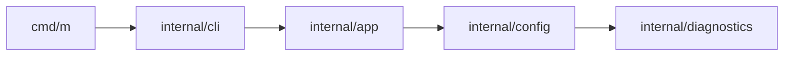

# 0010 — Core MVP 1 — CLI Foundation and Command Dispatch

## Document Control

| Item | Detail |
|---|---|
| Phase | Core / MVP 1 |
| Primary objective | Ship a stable command shell for `m` and `mx`, global flags, help, version output, command dispatch, and reserved-name policy. |
| Required predecessors | 0004, 0005, 0006, 0007 |
| Primary binaries | `m`, `mx` where applicable |
| Implementation language | Go for control plane and package-manager internals; embedded JavaScript only where Node extension APIs require it |
| Status at plan creation | Planned |

## Objective

Ship a stable command shell for `m` and `mx`, global flags, help, version output, command dispatch, and reserved-name policy.

This MVP must be independently reviewable, testable, and releasable behind an explicit experimental gate when it changes public behavior. It must leave stable interfaces for later MVPs and avoid shortcuts that make lockfile compatibility, transactional installation, or cross-platform support impossible.

## Sequence and Dependencies

- Complete and merge 0004 before starting this MVP.
- Complete and merge 0005 before starting this MVP.
- Complete and merge 0006 before starting this MVP.
- Complete and merge 0007 before starting this MVP.

Work inside this MVP should normally follow this order:

1. Freeze behavior and data contracts with fixtures and interface tests.
2. Implement the smallest vertical path that reaches a user-visible result.
3. Add failure injection and cross-platform coverage before broadening features.
4. Measure performance and resource use before declaring the MVP complete.
5. Record intentional differences from Nub and from incumbent package managers.

## Nub Reference Mapping

- Nub Clap command tree and binary-name dispatch
- Nub `nubx` entrypoint desugaring

The Nub implementation is a behavioral reference, not a source-level porting target. Mew must preserve observable semantics where parity is intentional while selecting Go-native architecture, concurrency, storage, and error-handling patterns.

## User-Visible Surface

```bash
m --help
```
```bash
m version
```
```bash
mx --help
```

## In Scope

- Cobra-based or equivalent Go command tree.
- Global config, reporter, color, cwd, offline, and debug flags.
- Binary-name detection for `m`, `mew`, `mx`, and `mewx` if aliases are distributed.
- Built-in command precedence required for future `m <script>` shortcuts.

## Explicit Non-Goals

- Do not implement features assigned to later indexed MVPs.
- Do not silently diverge from a documented compatibility contract.
- Do not optimize by weakening integrity, determinism, or crash safety.

## Architecture and Interfaces

- Keep command handlers thin and delegate to application services.
- Parse global flags before dynamic script fallback.
- Reserve future top-level command names from the feature inventory.

Every new package must expose narrow interfaces, accept `context.Context` for cancellable work, avoid global mutable state, and return typed errors carrying stable Mew error codes. Persistent formats must be versioned and deterministic.

## Detailed Implementation Checklist

### Contracts & types

- [ ] Implement cmd/m and cmd/mx main entrypoints with shared bootstrap
- [ ] Implement exit-code mapping from internal/diagnostics error codes
- [ ] Add hidden m __dispatch diagnostic showing effective command resolution
- [ ] Document command precedence: built-in > alias > script (future 0042)

### Core logic

- [ ] Create internal/cli root command with Cobra tree and persistent pre-run
- [ ] Add context cancellation propagation from SIGINT/SIGTERM
- [ ] Detect invoked binary name m vs mew and mx vs mewx for help text
- [ ] Keep handlers thin: parse flags, delegate to app services only

### CLI / UX

- [ ] Wire internal/app application context: cwd, config load, reporter init
- [ ] Register built-in command stubs for later MVPs with stable not-implemented errors
- [ ] Ensure global flags apply before any subcommand handler runs
- [ ] Avoid importing resolver, linker, fetch, or registry packages

### Tests & fixtures

- [ ] Implement m version with semver build metadata from ldflags
- [ ] Implement reserved-name list from feature inventory to block script collisions
- [ ] Add golden tests for --help and version output formatting

### Docs & observability

- [ ] Normalize global flags: --cwd, --offline, --debug, --color, --no-color
- [ ] Generate shell completion for bash, zsh, fish, and PowerShell
- [ ] Add table-driven tests for flag parsing edge cases

## Test Plan

<!-- ENRICHMENT-TESTS -->
- [ ] Acceptance: m --help and mx --help render stable usage without panic
- [ ] Acceptance: m version prints name, semver, commit, and build date
- [ ] Acceptance: Global --cwd changes effective project root for downstream services
- [ ] Acceptance: SIGINT returns non-zero exit and cancels in-flight context
- [ ] Acceptance: Reserved built-in names cannot be shadowed by future script shortcuts
- [ ] Fixture ready: `testdata/cli/help-golden/m-root.txt`
- [ ] Fixture ready: `testdata/cli/help-golden/mx-root.txt`
- [ ] Fixture ready: `testdata/cli/flags-matrix.json`
- [ ] Fixture ready: `fixtures/projects/empty-package-json`


Required test layers:

- Unit tests for parsing, normalization, deterministic ordering, and error classification.
- Golden tests for manifests, lockfiles, command output, and migration reports.
- Integration tests against local fixture registries and isolated temporary homes.
- Failure-injection tests for network interruption, disk exhaustion, permission errors, process termination, and corrupted cache entries.
- Cross-platform tests for Linux, macOS, and Windows, including path length, case sensitivity, junctions, symlinks, and executable shims.
- Conformance tests comparing intentional compatibility surfaces with the corresponding Nub or package-manager behavior.

## Performance Requirements

- Add benchmarks for every newly introduced hot path.
- Avoid unbounded goroutines, file descriptors, memory growth, or registry requests.
- Publish baseline measurements in repository benchmark artifacts.

All performance claims must be backed by reproducible benchmark commands, machine metadata, cold/warm cache separation, and multiple samples. Performance regressions on critical paths require an explicit waiver.

## Security and Trust Requirements

- Validate all external input and fail closed on malformed or ambiguous data.
- Use least-privilege filesystem access and redact credentials in diagnostics.
- Maintain integrity verification before extraction or execution.

Secrets must never be written to logs, lockfiles, snapshots, telemetry, crash reports, or plan files. Archive extraction, script execution, registry authentication, and path construction must be treated as hostile-input boundaries.

## Risks and Mitigations

- Compatibility drift: mitigate with fixture-based conformance tests.
- Cross-platform divergence: mitigate with platform-specific CI and filesystem probes.
- Premature abstraction: require at least two concrete callers before generalizing an interface.

## Deliverables

- [ ] Production implementation and public interfaces.
- [ ] Unit, integration, conformance, and failure-injection tests.
- [ ] User documentation and migration notes where behavior is public.
- [ ] Benchmark baseline and diagnostic instrumentation.

## Exit Criteria

- [ ] All required tests pass on supported operating systems.
- [ ] No unresolved correctness, integrity, or data-loss issue remains.
- [ ] Public behavior and intentional deviations are documented.
- [ ] The next dependent MVP can consume stable interfaces without reaching into internals.


<!-- ENRICHMENT:BEGIN -->

## Feature Inventory Links

Rows this MVP owns or primarily advances (from `0002` inventory themes):

| Feature | Nub baseline | Mew target | Primary MVP |
|---|---|---|---|
| m --help / --version | Nub CLI shell | Cobra command tree | 0010 |
| mx entrypoint | nubx | Executor binary stub | 0010 |
| Global flags cwd/offline/debug | Nub globals | Config + reporter wiring | 0010, 0006 |
| Reserved command names | Nub tree | Feature-inventory gate | 0010, 0042 |

## Go Package Map

**Packages / paths:**

- `cmd/m`
- `cmd/mx`
- `internal/app`
- `internal/cli`
- `internal/config`
- `internal/diagnostics`

**Forbidden import edges:**

- internal/resolver
- internal/linker
- internal/fetch
- internal/registry

## Data Flow



## Commands and Flags

| Surface | Flags | Notes |
|---|---|---|
| `m --help` | `--cwd`, `--offline`, `--debug`, `--color` | Globals parsed before subcommand |
| `m version` | `--json` | Build metadata from ldflags |
| `mx --help` | same globals | Thin executor shell |
| Exit codes | — | Map typed errors to stable CLI codes |

## Persistent Artifacts

| Artifact | Purpose |
|---|---|
| `cmd/m/main.go` | Primary CLI entry |
| `cmd/mx/main.go` | Executor entry |
| Shell completion scripts | Generated from Cobra |

## Concrete Test Fixtures

- `testdata/cli/help-golden/m-root.txt`
- `testdata/cli/help-golden/mx-root.txt`
- `testdata/cli/flags-matrix.json`
- `fixtures/projects/empty-package-json`

## Acceptance Scenarios

1. m --help and mx --help render stable usage without panic
2. m version prints name, semver, commit, and build date
3. Global --cwd changes effective project root for downstream services
4. SIGINT returns non-zero exit and cancels in-flight context
5. Reserved built-in names cannot be shadowed by future script shortcuts

## Nub Conformance Targets

- Nub Clap command tree shape | parity
- nubx entrypoint desugaring | parity
- Global flag semantics | parity

## Open Decisions

- Whether github.com/mewisme/mew/mewx alias binaries ship in v1 installers
- Default --color behavior on Windows terminals without ANSI

<!-- ENRICHMENT:END -->

## AI-Agent Handoff Contract

- Read 0000, 0003, 0005, 0007, 0008, and the immediate predecessor before changing code.
- Prefer small vertical pull requests over broad mechanical ports.
- Never copy Rust architecture blindly; preserve behavior and invariants using idiomatic Go.
- Update the feature matrix and conformance inventory when behavior changes.

Before submitting work, an agent must provide:

1. A concise behavior summary and the exact compatibility target.
2. A list of files and public interfaces changed.
3. Commands used for tests, benchmarks, and static analysis.
4. Known gaps, deferred cases, and platform limitations.
5. Evidence that generated files and fixtures are deterministic.
6. A rollback note for any persistent-format or migration change.
