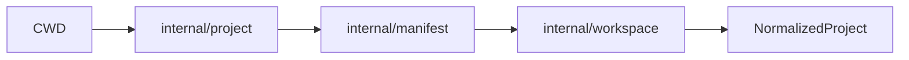

# 0011 — Core MVP 2 — Manifest Parsing and Project Discovery

## Document Control

| Item | Detail |
|---|---|
| Phase | Core / MVP 2 |
| Primary objective | Reliably discover projects and workspaces, read and update `package.json` without destructive reformatting, and expose normalized dependency declarations. |
| Required predecessors | 0010 |
| Primary binaries | `m`, `mx` where applicable |
| Implementation language | Go for control plane and package-manager internals; embedded JavaScript only where Node extension APIs require it |
| Status at plan creation | Planned |

## Objective

Reliably discover projects and workspaces, read and update `package.json` without destructive reformatting, and expose normalized dependency declarations.

This MVP must be independently reviewable, testable, and releasable behind an explicit experimental gate when it changes public behavior. It must leave stable interfaces for later MVPs and avoid shortcuts that make lockfile compatibility, transactional installation, or cross-platform support impossible.

## Sequence and Dependencies

- Complete and merge 0010 before starting this MVP.

Work inside this MVP should normally follow this order:

1. Freeze behavior and data contracts with fixtures and interface tests.
2. Implement the smallest vertical path that reaches a user-visible result.
3. Add failure injection and cross-platform coverage before broadening features.
4. Measure performance and resource use before declaring the MVP complete.
5. Record intentional differences from Nub and from incumbent package managers.

## Nub Reference Mapping

- Nub project-root discovery
- Aube manifest handling
- Nub order-preserving package.json edits

The Nub implementation is a behavioral reference, not a source-level porting target. Mew must preserve observable semantics where parity is intentional while selecting Go-native architecture, concurrency, storage, and error-handling patterns.

## User-Visible Surface

```bash
m project info
```
```bash
m init --manifest-only
```

## In Scope

- Upward package.json discovery.
- JSON parsing with duplicate-key and malformed-input diagnostics.
- Preserved indentation, newline, key order, and trailing newline.
- Dependencies, devDependencies, optionalDependencies, peerDependencies, scripts, engines, packageManager, workspaces, overrides, resolutions, catalogs, bin, files, publishConfig, os, and cpu fields.

## Explicit Non-Goals

- Do not implement features assigned to later indexed MVPs.
- Do not silently diverge from a documented compatibility contract.
- Do not optimize by weakening integrity, determinism, or crash safety.

## Architecture and Interfaces

- Represent edits as patches over parsed source where practical.
- Write through temporary files, fsync, and atomic replace.
- Separate semantic normalization from textual preservation.

Every new package must expose narrow interfaces, accept `context.Context` for cancellable work, avoid global mutable state, and return typed errors carrying stable Mew error codes. Persistent formats must be versioned and deterministic.

## Detailed Implementation Checklist

### Contracts & types

- [ ] Implement walk-up project root discovery from cwd with package.json boundary
- [ ] Detect packageManager and devEngines.packageManager for identity hints
- [ ] Support package.json in subpath importers for future workspace installs
- [ ] Cache parsed manifest per project root with file watcher invalidation hook

### Core logic

- [ ] Parse package.json without destructive reformatting or key reordering
- [ ] Expose read-only manifest accessor on internal/app project handle
- [ ] Add golden tests for manifest read/write on representative fixtures
- [ ] Keep manifest package free of network or filesystem mutation beyond package.json

### CLI / UX

- [ ] Normalize dependencies, devDependencies, peerDependencies, optionalDependencies
- [ ] Implement safe manifest field updates preserving comments and formatting where possible
- [ ] Add tests for workspace glob edge cases: negation, braces, duplicates

### Tests & fixtures

- [ ] Support workspaces field: array and {packages: [...]} forms
- [ ] Validate package name, version, and bin field shapes with actionable errors
- [ ] Document manifest normalization contract for resolver consumers

### Docs & observability

- [ ] Expand workspace globs to concrete member paths deterministically
- [ ] Handle missing package.json with typed not-found error code
- [ ] Reject cyclic workspace definitions with clear diagnostics

## Test Plan

<!-- ENRICHMENT-TESTS -->
- [ ] Acceptance: package.json round-trips without unintended whitespace or key loss
- [ ] Acceptance: Workspace globs resolve to stable sorted member list
- [ ] Acceptance: Project discovery stops at first valid root from cwd
- [ ] Acceptance: Invalid manifest fields produce stable machine-readable error codes
- [ ] Acceptance: Normalized dependency map matches npm semantics for scoped packages
- [ ] Fixture ready: `fixtures/projects/basic-cjs/package.json`
- [ ] Fixture ready: `fixtures/projects/workspace-simple/pnpm-workspace.yaml`
- [ ] Fixture ready: `fixtures/projects/workspace-nested/apps/*`
- [ ] Fixture ready: `testdata/manifest/golden/read-write/`


Required test layers:

- Unit tests for parsing, normalization, deterministic ordering, and error classification.
- Golden tests for manifests, lockfiles, command output, and migration reports.
- Integration tests against local fixture registries and isolated temporary homes.
- Failure-injection tests for network interruption, disk exhaustion, permission errors, process termination, and corrupted cache entries.
- Cross-platform tests for Linux, macOS, and Windows, including path length, case sensitivity, junctions, symlinks, and executable shims.
- Conformance tests comparing intentional compatibility surfaces with the corresponding Nub or package-manager behavior.

## Performance Requirements

- Add benchmarks for every newly introduced hot path.
- Avoid unbounded goroutines, file descriptors, memory growth, or registry requests.
- Publish baseline measurements in repository benchmark artifacts.

All performance claims must be backed by reproducible benchmark commands, machine metadata, cold/warm cache separation, and multiple samples. Performance regressions on critical paths require an explicit waiver.

## Security and Trust Requirements

- Validate all external input and fail closed on malformed or ambiguous data.
- Use least-privilege filesystem access and redact credentials in diagnostics.
- Maintain integrity verification before extraction or execution.

Secrets must never be written to logs, lockfiles, snapshots, telemetry, crash reports, or plan files. Archive extraction, script execution, registry authentication, and path construction must be treated as hostile-input boundaries.

## Risks and Mitigations

- Compatibility drift: mitigate with fixture-based conformance tests.
- Cross-platform divergence: mitigate with platform-specific CI and filesystem probes.
- Premature abstraction: require at least two concrete callers before generalizing an interface.

## Deliverables

- [ ] Production implementation and public interfaces.
- [ ] Unit, integration, conformance, and failure-injection tests.
- [ ] User documentation and migration notes where behavior is public.
- [ ] Benchmark baseline and diagnostic instrumentation.

## Exit Criteria

- [ ] All required tests pass on supported operating systems.
- [ ] No unresolved correctness, integrity, or data-loss issue remains.
- [ ] Public behavior and intentional deviations are documented.
- [ ] The next dependent MVP can consume stable interfaces without reaching into internals.


<!-- ENRICHMENT:BEGIN -->

## Feature Inventory Links

Rows this MVP owns or primarily advances (from `0002` inventory themes):

| Feature | Nub baseline | Mew target | Primary MVP |
|---|---|---|---|
| package.json read/write | Nub manifest | Lossless round-trip | 0011 |
| Project root discovery | Nub walk-up | package.json + lock hints | 0011 |
| Workspace globs | pnpm workspaces | Normalized workspace graph | 0011, 0022 |
| Dependency declarations | npm fields | deps/devDeps/peerDeps/optional | 0011 |

## Go Package Map

**Packages / paths:**

- `internal/manifest`
- `internal/project`
- `internal/workspace`
- `internal/app`

**Forbidden import edges:**

- internal/resolver
- internal/linker
- internal/fetch

## Data Flow



## Commands and Flags

| Surface | Flags | Notes |
|---|---|---|
| `m pkg get <field>` | `--json` | Read normalized manifest fields (dev) |
| Discovery | `--cwd` | Walk-up from cwd to project root |
| N/A public install | — | No mutation commands until 0016 |

## Persistent Artifacts

| Artifact | Purpose |
|---|---|
| Normalized manifest model | Shared dependency declarations |
| Workspace member index | Monorepo discovery cache |

## Concrete Test Fixtures

- `fixtures/projects/basic-cjs/package.json`
- `fixtures/projects/workspace-simple/pnpm-workspace.yaml`
- `fixtures/projects/workspace-nested/apps/*`
- `testdata/manifest/golden/read-write/`

## Acceptance Scenarios

1. package.json round-trips without unintended whitespace or key loss
2. Workspace globs resolve to stable sorted member list
3. Project discovery stops at first valid root from cwd
4. Invalid manifest fields produce stable machine-readable error codes
5. Normalized dependency map matches npm semantics for scoped packages

## Nub Conformance Targets

- package.json field semantics | parity
- Workspace glob expansion | parity
- Project root walk-up | parity

## Open Decisions

- Whether to preserve exact JSON key ordering on write
- Support package.json5 or only strict JSON in v1

<!-- ENRICHMENT:END -->

## AI-Agent Handoff Contract

- Read 0000, 0003, 0005, 0007, 0008, and the immediate predecessor before changing code.
- Prefer small vertical pull requests over broad mechanical ports.
- Never copy Rust architecture blindly; preserve behavior and invariants using idiomatic Go.
- Update the feature matrix and conformance inventory when behavior changes.

Before submitting work, an agent must provide:

1. A concise behavior summary and the exact compatibility target.
2. A list of files and public interfaces changed.
3. Commands used for tests, benchmarks, and static analysis.
4. Known gaps, deferred cases, and platform limitations.
5. Evidence that generated files and fixtures are deterministic.
6. A rollback note for any persistent-format or migration change.
