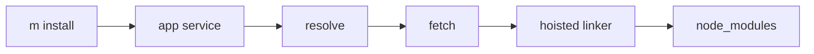

# 0016 — Core MVP 7 — Basic End-to-End Installer

## Document Control

| Item | Detail |
|---|---|
| Phase | Core / MVP 7 |
| Primary objective | Deliver the first usable `m install`, `m add`, and `m remove` path using `m.lock`, a project-local staging area, and a conservative hoisted layout. |
| Required predecessors | 0011, 0013, 0014, 0015 |
| Primary binaries | `m`, `mx` where applicable |
| Implementation language | Go for control plane and package-manager internals; embedded JavaScript only where Node extension APIs require it |
| Status at plan creation | Planned |

## Objective

Deliver the first usable `m install`, `m add`, and `m remove` path using `m.lock`, a project-local staging area, and a conservative hoisted layout.

This MVP must be independently reviewable, testable, and releasable behind an explicit experimental gate when it changes public behavior. It must leave stable interfaces for later MVPs and avoid shortcuts that make lockfile compatibility, transactional installation, or cross-platform support impossible.

## Sequence and Dependencies

- Complete and merge 0011 before starting this MVP.
- Complete and merge 0013 before starting this MVP.
- Complete and merge 0014 before starting this MVP.
- Complete and merge 0015 before starting this MVP.

Work inside this MVP should normally follow this order:

1. Freeze behavior and data contracts with fixtures and interface tests.
2. Implement the smallest vertical path that reaches a user-visible result.
3. Add failure injection and cross-platform coverage before broadening features.
4. Measure performance and resource use before declaring the MVP complete.
5. Record intentional differences from Nub and from incumbent package managers.

## Nub Reference Mapping

- Nub install/add/remove frontends
- Aube install orchestration

The Nub implementation is a behavioral reference, not a source-level porting target. Mew must preserve observable semantics where parity is intentional while selecting Go-native architecture, concurrency, storage, and error-handling patterns.

## User-Visible Surface

```bash
m install
```
```bash
m add lodash
```
```bash
m add -D typescript
```
```bash
m remove lodash
```

## In Scope

- New-project install from package.json.
- Install from existing valid `m.lock`.
- Manifest mutation for add/remove.
- Basic hoisted node_modules layout.
- `.bin` links or shims.
- Production and development dependency selection.
- Dry-run and lockfile-only modes.

## Explicit Non-Goals

- Do not implement features assigned to later indexed MVPs.
- Do not silently diverge from a documented compatibility contract.
- Do not optimize by weakening integrity, determinism, or crash safety.

## Architecture and Interfaces

- Resolve and fetch completely before mutating project state.
- Create layout in staging and publish only after validation.
- Keep physical layout strategy behind linker interfaces.

Every new package must expose narrow interfaces, accept `context.Context` for cancellable work, avoid global mutable state, and return typed errors carrying stable Mew error codes. Persistent formats must be versioned and deterministic.

## Detailed Implementation Checklist

### Contracts & types

- [ ] Implement install application service orchestrating resolve-fetch-link
- [ ] Create .bin directory with platform shims for declared bins
- [ ] Support --dry-run printing plan without disk mutation
- [ ] Failure tests: original node_modules remains usable on error

### Core logic

- [ ] Resolve from package.json or existing m.lock per policy
- [ ] Implement m add with dev/prod dependency type selection
- [ ] Support --frozen-lockfile failing on drift
- [ ] Document non-goals: no global store, no isolated layout yet

### CLI / UX

- [ ] Fetch all packages before any node_modules mutation
- [ ] Implement m remove with manifest and lockfile update
- [ ] Emit install summary: added, removed, changed counts

### Tests & fixtures

- [ ] Implement conservative hoisted linker placing deps at top level
- [ ] Prune stale packages from hoisted tree after remove
- [ ] Add integration tests: install from empty, from lock, add, remove

### Docs & observability

- [ ] Materialize node_modules in staging directory before publish
- [ ] Support --prod to omit devDependencies
- [ ] Compare require() behavior with npm on basic-cjs fixture

## Test Plan

<!-- ENRICHMENT-TESTS -->
- [ ] Acceptance: m install on greenfield project produces working node_modules
- [ ] Acceptance: m add lodash updates m.lock and node_modules
- [ ] Acceptance: m remove prunes unused packages from hoisted tree
- [ ] Acceptance: Failed install does not leave corrupt partial node_modules
- [ ] Acceptance: m install --frozen-lockfile fails when package.json changed
- [ ] Fixture ready: `fixtures/projects/basic-cjs`
- [ ] Fixture ready: `fixtures/projects/typescript-app`
- [ ] Fixture ready: `fixtures/projects/scoped-deps`
- [ ] Fixture ready: `fixtures/projects/bin-shims`


Required test layers:

- Unit tests for parsing, normalization, deterministic ordering, and error classification.
- Golden tests for manifests, lockfiles, command output, and migration reports.
- Integration tests against local fixture registries and isolated temporary homes.
- Failure-injection tests for network interruption, disk exhaustion, permission errors, process termination, and corrupted cache entries.
- Cross-platform tests for Linux, macOS, and Windows, including path length, case sensitivity, junctions, symlinks, and executable shims.
- Conformance tests comparing intentional compatibility surfaces with the corresponding Nub or package-manager behavior.

## Performance Requirements

- Add benchmarks for every newly introduced hot path.
- Avoid unbounded goroutines, file descriptors, memory growth, or registry requests.
- Publish baseline measurements in repository benchmark artifacts.

All performance claims must be backed by reproducible benchmark commands, machine metadata, cold/warm cache separation, and multiple samples. Performance regressions on critical paths require an explicit waiver.

## Security and Trust Requirements

- Validate all external input and fail closed on malformed or ambiguous data.
- Use least-privilege filesystem access and redact credentials in diagnostics.
- Maintain integrity verification before extraction or execution.

Secrets must never be written to logs, lockfiles, snapshots, telemetry, crash reports, or plan files. Archive extraction, script execution, registry authentication, and path construction must be treated as hostile-input boundaries.

## Risks and Mitigations

- Compatibility drift: mitigate with fixture-based conformance tests.
- Cross-platform divergence: mitigate with platform-specific CI and filesystem probes.
- Premature abstraction: require at least two concrete callers before generalizing an interface.

## Deliverables

- [ ] Production implementation and public interfaces.
- [ ] Unit, integration, conformance, and failure-injection tests.
- [ ] User documentation and migration notes where behavior is public.
- [ ] Benchmark baseline and diagnostic instrumentation.

## Exit Criteria

- [ ] All required tests pass on supported operating systems.
- [ ] No unresolved correctness, integrity, or data-loss issue remains.
- [ ] Public behavior and intentional deviations are documented.
- [ ] The next dependent MVP can consume stable interfaces without reaching into internals.


<!-- ENRICHMENT:BEGIN -->

## Feature Inventory Links

Rows this MVP owns or primarily advances (from `0002` inventory themes):

| Feature | Nub baseline | Mew target | Primary MVP |
|---|---|---|---|
| m install | Nub install | First end-to-end path | 0016 |
| m add / m remove | Nub add/remove | Manifest + lock mutation | 0016 |
| Hoisted node_modules | npm layout | Conservative hoisted linker | 0016, 0019 |
| .bin shims | npm bin | Platform executables | 0016 |

## Go Package Map

**Packages / paths:**

- `internal/app`
- `internal/resolver`
- `internal/fetch`
- `internal/lockfile`
- `internal/linker`
- `internal/manifest`

**Forbidden import edges:**

- internal/transaction
- internal/store

## Data Flow



## Commands and Flags

| Surface | Flags | Notes |
|---|---|---|
| `m install` | `--prod`, `--frozen-lockfile`, `--dry-run` | Full install path |
| `m add <pkg>` | `-D`, `-E`, `--save-exact` | Manifest + lock update |
| `m remove <pkg>` | — | Prune from manifest and tree |

## Persistent Artifacts

| Artifact | Purpose |
|---|---|
| `node_modules/` | Hoisted install layout |
| `m.lock` | Updated on add/remove |
| `.bin/` shims | Executable discovery |

## Concrete Test Fixtures

- `fixtures/projects/basic-cjs`
- `fixtures/projects/typescript-app`
- `fixtures/projects/scoped-deps`
- `fixtures/projects/bin-shims`

## Acceptance Scenarios

1. m install on greenfield project produces working node_modules
2. m add lodash updates m.lock and node_modules
3. m remove prunes unused packages from hoisted tree
4. Failed install does not leave corrupt partial node_modules
5. m install --frozen-lockfile fails when package.json changed

## Nub Conformance Targets

- npm hoisted install layout | parity
- add/remove manifest mutation | parity
- bin shim behavior | parity

## Open Decisions

- Default linker mode before 0019 isolated support
- Whether install runs lifecycle scripts in 0016 or defers to 0021

<!-- ENRICHMENT:END -->

## AI-Agent Handoff Contract

- Read 0000, 0003, 0005, 0007, 0008, and the immediate predecessor before changing code.
- Prefer small vertical pull requests over broad mechanical ports.
- Never copy Rust architecture blindly; preserve behavior and invariants using idiomatic Go.
- Update the feature matrix and conformance inventory when behavior changes.

Before submitting work, an agent must provide:

1. A concise behavior summary and the exact compatibility target.
2. A list of files and public interfaces changed.
3. Commands used for tests, benchmarks, and static analysis.
4. Known gaps, deferred cases, and platform limitations.
5. Evidence that generated files and fixtures are deterministic.
6. A rollback note for any persistent-format or migration change.
