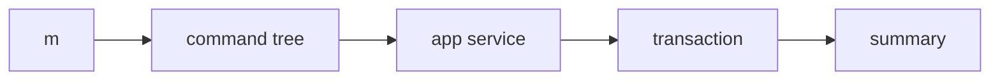

# 0026 — Core MVP 17 — Complete Package-Manager Command Surface

## Document Control

| Item | Detail |
|---|---|
| Phase | Core / MVP 17 |
| Primary objective | Complete the package-manager command family with a coherent Mew grammar, documented pnpm-compatible areas, and safe transaction-backed mutations. |
| Required predecessors | 0021, 0022, 0023, 0024, 0025 |
| Primary binaries | `m`, `mx` where applicable |
| Implementation language | Go for control plane and package-manager internals; embedded JavaScript only where Node extension APIs require it |
| Status at plan creation | Planned |

## Objective

Complete the package-manager command family with a coherent Mew grammar, documented pnpm-compatible areas, and safe transaction-backed mutations.

This MVP must be independently reviewable, testable, and releasable behind an explicit experimental gate when it changes public behavior. It must leave stable interfaces for later MVPs and avoid shortcuts that make lockfile compatibility, transactional installation, or cross-platform support impossible.

## Sequence and Dependencies

- Complete and merge 0021 before starting this MVP.
- Complete and merge 0022 before starting this MVP.
- Complete and merge 0023 before starting this MVP.
- Complete and merge 0024 before starting this MVP.
- Complete and merge 0025 before starting this MVP.

Work inside this MVP should normally follow this order:

1. Freeze behavior and data contracts with fixtures and interface tests.
2. Implement the smallest vertical path that reaches a user-visible result.
3. Add failure injection and cross-platform coverage before broadening features.
4. Measure performance and resource use before declaring the MVP complete.
5. Record intentional differences from Nub and from incumbent package managers.

## Nub Reference Mapping

- Nub pnpm-compatible PM frontend
- Nub install/import/dedupe/info/store/config/publish families

The Nub implementation is a behavioral reference, not a source-level porting target. Mew must preserve observable semantics where parity is intentional while selecting Go-native architecture, concurrency, storage, and error-handling patterns.

## User-Visible Surface

```bash
m install
```
```bash
m ci
```
```bash
m add
```
```bash
m remove
```
```bash
m update
```
```bash
m import
```
```bash
m dedupe
```
```bash
m prune
```
```bash
m list
```
```bash
m why
```
```bash
m outdated
```
```bash
m view
```
```bash
m pack
```
```bash
m publish
```

## In Scope

- Install, CI, add, remove, update, unlink, import, dedupe, prune, rebuild, list, why, outdated, view, fetch, pack, publish, store, cache, and config families.
- Workspace filters and recursive operation.
- Global mode only where it has a clear Mew storage model.
- Machine-readable output for automation.

## Explicit Non-Goals

- Do not implement features assigned to later indexed MVPs.
- Do not silently diverge from a documented compatibility contract.
- Do not optimize by weakening integrity, determinism, or crash safety.

## Architecture and Interfaces

- Built-in commands always win over script shortcuts.
- Every mutating command produces an install plan and transaction.
- Aliases and flags are inventoried and tested rather than accumulated informally.

Every new package must expose narrow interfaces, accept `context.Context` for cancellable work, avoid global mutable state, and return typed errors carrying stable Mew error codes. Persistent formats must be versioned and deterministic.

## Detailed Implementation Checklist

### Contracts & types

- [ ] Complete PM subcommand tree with consistent flag naming
- [ ] Implement m list (m ls) dependency tree display
- [ ] Generate comprehensive --help per subcommand
- [ ] Exit codes consistent across PM commands

### Core logic

- [ ] Implement m ci: clean install from lock in CI mode
- [ ] Route all mutating commands through transaction journal
- [ ] Add integration tests per command on fixture projects
- [ ] Deprecate stubs replaced by real implementations with warnings

### CLI / UX

- [ ] Implement m outdated with recursive workspace support
- [ ] Unify --dry-run behavior across install family
- [ ] Document Mew grammar divergences from pnpm/npm

### Tests & fixtures

- [ ] Implement m dedupe rewriting lock to minimal graph
- [ ] Unify --frozen-lockfile across ci and install
- [ ] Ensure mx does not expose PM commands

### Docs & observability

- [ ] Implement m prune removing extraneous node_modules packages
- [ ] Add pnpm-compatible flag aliases where documented
- [ ] Stable JSON output for outdated --json

## Test Plan

<!-- ENRICHMENT-TESTS -->
- [ ] Acceptance: m ci fails when lockfile out of sync with manifest
- [ ] Acceptance: m outdated reports available updates as JSON
- [ ] Acceptance: m dedupe reduces duplicate packages in lock
- [ ] Acceptance: All mutating commands rollback on failure
- [ ] Acceptance: Help text complete for every PM subcommand
- [ ] Fixture ready: `fixtures/projects/ci-clean-install`
- [ ] Fixture ready: `fixtures/projects/outdated-tree`
- [ ] Fixture ready: `fixtures/projects/dedupe-duplicates`


Required test layers:

- Unit tests for parsing, normalization, deterministic ordering, and error classification.
- Golden tests for manifests, lockfiles, command output, and migration reports.
- Integration tests against local fixture registries and isolated temporary homes.
- Failure-injection tests for network interruption, disk exhaustion, permission errors, process termination, and corrupted cache entries.
- Cross-platform tests for Linux, macOS, and Windows, including path length, case sensitivity, junctions, symlinks, and executable shims.
- Conformance tests comparing intentional compatibility surfaces with the corresponding Nub or package-manager behavior.

## Performance Requirements

- Add benchmarks for every newly introduced hot path.
- Avoid unbounded goroutines, file descriptors, memory growth, or registry requests.
- Publish baseline measurements in repository benchmark artifacts.

All performance claims must be backed by reproducible benchmark commands, machine metadata, cold/warm cache separation, and multiple samples. Performance regressions on critical paths require an explicit waiver.

## Security and Trust Requirements

- Validate all external input and fail closed on malformed or ambiguous data.
- Use least-privilege filesystem access and redact credentials in diagnostics.
- Maintain integrity verification before extraction or execution.

Secrets must never be written to logs, lockfiles, snapshots, telemetry, crash reports, or plan files. Archive extraction, script execution, registry authentication, and path construction must be treated as hostile-input boundaries.

## Risks and Mitigations

- Compatibility drift: mitigate with fixture-based conformance tests.
- Cross-platform divergence: mitigate with platform-specific CI and filesystem probes.
- Premature abstraction: require at least two concrete callers before generalizing an interface.

## Deliverables

- [ ] Production implementation and public interfaces.
- [ ] Unit, integration, conformance, and failure-injection tests.
- [ ] User documentation and migration notes where behavior is public.
- [ ] Benchmark baseline and diagnostic instrumentation.

## Exit Criteria

- [ ] All required tests pass on supported operating systems.
- [ ] No unresolved correctness, integrity, or data-loss issue remains.
- [ ] Public behavior and intentional deviations are documented.
- [ ] The next dependent MVP can consume stable interfaces without reaching into internals.


<!-- ENRICHMENT:BEGIN -->

## Feature Inventory Links

Rows this MVP owns or primarily advances (from `0002` inventory themes):

| Feature | Nub baseline | Mew target | Primary MVP |
|---|---|---|---|
| Full PM command family | Nub CLI | Coherent m grammar | 0026 |
| m ci / m outdated | pnpm/npm | CI and upgrade discovery | 0026 |
| m dedupe / m prune | npm | Graph maintenance commands | 0026 |
| Transaction-backed mutations | Nub | All writes via journal | 0026 |

## Go Package Map

**Packages / paths:**

- `internal/cli`
- `internal/app`
- `internal/transaction`
- `internal/manifest`
- `internal/resolver`

**Forbidden import edges:**

- None beyond architecture rules in 0003 / AGENTS.md.

## Data Flow



## Commands and Flags

| Surface | Flags | Notes |
|---|---|---|
| `m ci` | `--frozen-lockfile` | Clean CI install |
| `m outdated` | `--recursive`, `--json` | Version drift report |
| `m dedupe` | `--dry-run` | Dedupe dependency tree |
| `m prune` | `--prod` | Remove extraneous packages |
| `m publish` | stub | Full surface in 0027 |

## Persistent Artifacts

| Artifact | Purpose |
|---|---|
| Command help text | Complete PM surface docs |
| CI install marker | node_modules/.m-ci if needed |

## Concrete Test Fixtures

- `fixtures/projects/ci-clean-install`
- `fixtures/projects/outdated-tree`
- `fixtures/projects/dedupe-duplicates`

## Acceptance Scenarios

1. m ci fails when lockfile out of sync with manifest
2. m outdated reports available updates as JSON
3. m dedupe reduces duplicate packages in lock
4. All mutating commands rollback on failure
5. Help text complete for every PM subcommand

## Nub Conformance Targets

- pnpm CLI flag compatibility | parity
- npm ci behavior | parity
- Nub PM command coverage | parity

## Open Decisions

- Exact pnpm flag alias set to support in v1
- Whether m import/rebuild ship in 0026 or later

<!-- ENRICHMENT:END -->

## AI-Agent Handoff Contract

- Read 0000, 0003, 0005, 0007, 0008, and the immediate predecessor before changing code.
- Prefer small vertical pull requests over broad mechanical ports.
- Never copy Rust architecture blindly; preserve behavior and invariants using idiomatic Go.
- Update the feature matrix and conformance inventory when behavior changes.

Before submitting work, an agent must provide:

1. A concise behavior summary and the exact compatibility target.
2. A list of files and public interfaces changed.
3. Commands used for tests, benchmarks, and static analysis.
4. Known gaps, deferred cases, and platform limitations.
5. Evidence that generated files and fixtures are deterministic.
6. A rollback note for any persistent-format or migration change.
