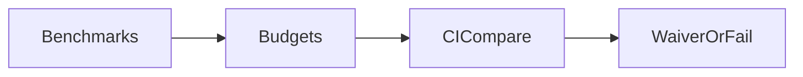

# 0081 — Cross-Cutting — Performance and Resource Program

## Document Control

| Item | Detail |
|---|---|
| Phase | Cross-Cutting |
| Primary objective | Measure and control startup, resolution, network, extraction, linking, script, transform, memory, disk, and process overhead throughout development. |
| Required predecessors | 0008, 0010 |
| Primary binaries | `m`, `mx` where applicable |
| Implementation language | Go for control plane and package-manager internals; embedded JavaScript only where Node extension APIs require it |
| Status at plan creation | Planned |

## Objective

Measure and control startup, resolution, network, extraction, linking, script, transform, memory, disk, and process overhead throughout development.

This MVP must be independently reviewable, testable, and releasable behind an explicit experimental gate when it changes public behavior. It must leave stable interfaces for later MVPs and avoid shortcuts that make lockfile compatibility, transactional installation, or cross-platform support impossible.

## Sequence and Dependencies

- Complete and merge 0008 before starting this MVP.
- Complete and merge 0010 before starting this MVP.

Work inside this MVP should normally follow this order:

1. Freeze behavior and data contracts with fixtures and interface tests.
2. Implement the smallest vertical path that reaches a user-visible result.
3. Add failure injection and cross-platform coverage before broadening features.
4. Measure performance and resource use before declaring the MVP complete.
5. Record intentional differences from Nub and from incumbent package managers.

## Nub Reference Mapping

- Nub benchmark and cache-hash focus
- Aube install performance architecture

The Nub implementation is a behavioral reference, not a source-level porting target. Mew must preserve observable semantics where parity is intentional while selecting Go-native architecture, concurrency, storage, and error-handling patterns.

## User-Visible Surface

```bash
m benchmark list
```
```bash
m benchmark run install-warm
```

## In Scope

- Microbenchmarks and end-to-end benchmarks.
- Cold, warm, offline, and changed-one-dependency scenarios.
- Small, medium, large, and monorepo fixtures.
- CPU, memory, allocations, disk writes, file descriptors, processes, network bytes, and wall time.
- Regression thresholds and artifact history.

## Explicit Non-Goals

- Do not implement features assigned to later indexed MVPs.
- Do not silently diverge from a documented compatibility contract.
- Do not optimize by weakening integrity, determinism, or crash safety.

## Architecture and Interfaces

- Benchmarks support engineering decisions, not unsupported marketing claims.
- Record machine, OS, filesystem, Node, registry, and cache state.
- Use medians and distribution data over single runs.

Every new package must expose narrow interfaces, accept `context.Context` for cancellable work, avoid global mutable state, and return typed errors carrying stable Mew error codes. Persistent formats must be versioned and deterministic.

## Detailed Implementation Checklist

### Contracts & types

- [ ] List hot paths: startup, resolve, fetch, extract, link, scripts, transform
- [ ] Document waiver process with expiry
- [ ] Track network request counts
- [ ] Separate micro vs end-to-end

### Core logic

- [ ] Define cold vs warm cache benches
- [ ] Bench install on fixture graphs S/M/L
- [ ] Flamegraph/pprof guidance
- [ ] Prevent silent bench deletion

### CLI / UX

- [ ] Publish baseline artifacts with machine metadata
- [ ] Bench m --help startup
- [ ] No unbounded worker pools
- [ ] Agent evidence requires bench commands

### Tests & fixtures

- [ ] CI regression detection with noise tolerance
- [ ] Bench transform TS hello
- [ ] Link budgets to MVP owners

### Docs & observability

- [ ] Resource ceilings: goroutines, FDs, memory
- [ ] Track disk amplification
- [ ] Windows bench runners where meaningful

## Test Plan

<!-- ENRICHMENT-TESTS -->
- [ ] Acceptance: Baselines recorded for critical paths
- [ ] Acceptance: CI fails on budget breach without waiver
- [ ] Acceptance: Cold/warm separated in reports
- [ ] Fixture ready: `benchmarks/graphs/small`
- [ ] Fixture ready: `benchmarks/graphs/medium`
- [ ] Fixture ready: `docs/performance/budgets.md`


Required test layers:

- Unit tests for parsing, normalization, deterministic ordering, and error classification.
- Golden tests for manifests, lockfiles, command output, and migration reports.
- Integration tests against local fixture registries and isolated temporary homes.
- Failure-injection tests for network interruption, disk exhaustion, permission errors, process termination, and corrupted cache entries.
- Cross-platform tests for Linux, macOS, and Windows, including path length, case sensitivity, junctions, symlinks, and executable shims.
- Conformance tests comparing intentional compatibility surfaces with the corresponding Nub or package-manager behavior.

## Performance Requirements

- Add benchmarks for every newly introduced hot path.
- Avoid unbounded goroutines, file descriptors, memory growth, or registry requests.
- Publish baseline measurements in repository benchmark artifacts.

All performance claims must be backed by reproducible benchmark commands, machine metadata, cold/warm cache separation, and multiple samples. Performance regressions on critical paths require an explicit waiver.

## Security and Trust Requirements

- Validate all external input and fail closed on malformed or ambiguous data.
- Use least-privilege filesystem access and redact credentials in diagnostics.
- Maintain integrity verification before extraction or execution.

Secrets must never be written to logs, lockfiles, snapshots, telemetry, crash reports, or plan files. Archive extraction, script execution, registry authentication, and path construction must be treated as hostile-input boundaries.

## Risks and Mitigations

- Compatibility drift: mitigate with fixture-based conformance tests.
- Cross-platform divergence: mitigate with platform-specific CI and filesystem probes.
- Premature abstraction: require at least two concrete callers before generalizing an interface.

## Deliverables

- [ ] Production implementation and public interfaces.
- [ ] Unit, integration, conformance, and failure-injection tests.
- [ ] User documentation and migration notes where behavior is public.
- [ ] Benchmark baseline and diagnostic instrumentation.

## Exit Criteria

- [ ] All required tests pass on supported operating systems.
- [ ] No unresolved correctness, integrity, or data-loss issue remains.
- [ ] Public behavior and intentional deviations are documented.
- [ ] The next dependent MVP can consume stable interfaces without reaching into internals.


<!-- ENRICHMENT:BEGIN -->

## Feature Inventory Links

Rows this MVP owns or primarily advances (from `0002` inventory themes):

| Feature | Nub baseline | Mew target | Primary MVP |
|---|---|---|---|
| Performance program | Nub benches | Continuous budgets | 0081 |
| Resource ceilings | Engineering | FD/mem/goroutine bounds | 0081 |

## Go Package Map

**Packages / paths:**

- `benchmarks/`
- `internal/perf`
- `docs/performance`

**Forbidden import edges:**

- None beyond architecture rules in 0003 / AGENTS.md.

## Data Flow



## Commands and Flags

| Command | Purpose |
|---|---|
| `make bench` | Run benchmarks |
| `go test -bench` | Package benches |

## Persistent Artifacts

| Artifact | Purpose |
|---|---|
| Bench JSON | Baselines |
| Budget file | Thresholds |

## Concrete Test Fixtures

- `benchmarks/graphs/small`
- `benchmarks/graphs/medium`
- `docs/performance/budgets.md`

## Acceptance Scenarios

1. Baselines recorded for critical paths
2. CI fails on budget breach without waiver
3. Cold/warm separated in reports

## Nub Conformance Targets

- Performance discipline | extension

## Open Decisions

- Absolute vs relative regression thresholds

<!-- ENRICHMENT:END -->

## AI-Agent Handoff Contract

- Read 0000, 0003, 0005, 0007, 0008, and the immediate predecessor before changing code.
- Prefer small vertical pull requests over broad mechanical ports.
- Never copy Rust architecture blindly; preserve behavior and invariants using idiomatic Go.
- Update the feature matrix and conformance inventory when behavior changes.

Before submitting work, an agent must provide:

1. A concise behavior summary and the exact compatibility target.
2. A list of files and public interfaces changed.
3. Commands used for tests, benchmarks, and static analysis.
4. Known gaps, deferred cases, and platform limitations.
5. Evidence that generated files and fixtures are deterministic.
6. A rollback note for any persistent-format or migration change.
