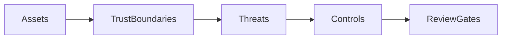

# 0082 — Cross-Cutting — Threat Model and Security Review Plan

## Document Control

| Item | Detail |
|---|---|
| Phase | Cross-Cutting |
| Primary objective | Define adversaries, assets, trust boundaries, abuse cases, and mandatory reviews for a tool that downloads and executes third-party code. |
| Required predecessors | 0003, 0005 |
| Primary binaries | `m`, `mx` where applicable |
| Implementation language | Go for control plane and package-manager internals; embedded JavaScript only where Node extension APIs require it |
| Status at plan creation | Planned |

## Objective

Define adversaries, assets, trust boundaries, abuse cases, and mandatory reviews for a tool that downloads and executes third-party code.

This MVP must be independently reviewable, testable, and releasable behind an explicit experimental gate when it changes public behavior. It must leave stable interfaces for later MVPs and avoid shortcuts that make lockfile compatibility, transactional installation, or cross-platform support impossible.

## Sequence and Dependencies

- Complete and merge 0003 before starting this MVP.
- Complete and merge 0005 before starting this MVP.

Work inside this MVP should normally follow this order:

1. Freeze behavior and data contracts with fixtures and interface tests.
2. Implement the smallest vertical path that reaches a user-visible result.
3. Add failure injection and cross-platform coverage before broadening features.
4. Measure performance and resource use before declaring the MVP complete.
5. Record intentional differences from Nub and from incumbent package managers.

## Nub Reference Mapping

- Nub/Aube registry, archive, script, shim, runtime addon, and provisioning boundaries

The Nub implementation is a behavioral reference, not a source-level porting target. Mew must preserve observable semantics where parity is intentional while selecting Go-native architecture, concurrency, storage, and error-handling patterns.

## User-Visible Surface

No new command is required in this MVP.

## In Scope

- Registry and network attackers.
- Malicious package metadata, tarballs, scripts, bins, source maps, loaders, plugins, and lockfiles.
- Compromised cache/store content.
- Local multi-user and symlink attacks.
- Credential theft and log leakage.
- Shim/PATH hijacking.
- Runtime IPC and embedded asset attacks.
- Update-channel and release compromise.

## Explicit Non-Goals

- Do not implement features assigned to later indexed MVPs.
- Do not silently diverge from a documented compatibility contract.
- Do not optimize by weakening integrity, determinism, or crash safety.

## Architecture and Interfaces

- Apply defense in depth; integrity alone does not make code safe to execute.
- Document unsupported isolation rather than presenting best-effort sandboxing as complete containment.
- Require review for any new execution, extraction, credential, or updater boundary.

Every new package must expose narrow interfaces, accept `context.Context` for cancellable work, avoid global mutable state, and return typed errors carrying stable Mew error codes. Persistent formats must be versioned and deterministic.

## Detailed Implementation Checklist

### Contracts & types

- [ ] Identify assets: credentials, lockfiles, store, scripts, Node bins
- [ ] Secure coding checklist
- [ ] Shim PATH hijack cases
- [ ] Periodic threat-model refresh

### Core logic

- [ ] Define trust boundaries: registry, git, filesystem, plugins, CI
- [ ] Fail-closed defaults policy
- [ ] Dependency confusion cases
- [ ] No secrets in plans/logs

### CLI / UX

- [ ] Enumerate adversaries and abuse cases
- [ ] Archive extraction threat cases
- [ ] Signed release verification
- [ ] Agent escalation triggers

### Tests & fixtures

- [ ] Map controls to MVPs (integrity, sandbox, consent, redaction)
- [ ] Lifecycle script threat cases
- [ ] Incident response outline

### Docs & observability

- [ ] Mandatory review triggers for security-boundary changes
- [ ] mx consent threat cases
- [ ] Link to 0021/0030/0044/0062

## Test Plan

<!-- ENRICHMENT-TESTS -->
- [ ] Acceptance: Threat model covers download+execute surfaces
- [ ] Acceptance: Every abuse case maps to a control or accepted risk
- [ ] Acceptance: Security boundary PRs require checklist
- [ ] Fixture ready: `docs/security/abuse-cases.md`
- [ ] Fixture ready: `testdata/security/evil-tarball-cases.md`

Required test layers:

- Unit tests for parsing, normalization, deterministic ordering, and error classification.
- Golden tests for manifests, lockfiles, command output, and migration reports.
- Integration tests against local fixture registries and isolated temporary homes.
- Failure-injection tests for network interruption, disk exhaustion, permission errors, process termination, and corrupted cache entries.
- Cross-platform tests for Linux, macOS, and Windows, including path length, case sensitivity, junctions, symlinks, and executable shims.
- Conformance tests comparing intentional compatibility surfaces with the corresponding Nub or package-manager behavior.

## Performance Requirements

- Add benchmarks for every newly introduced hot path.
- Avoid unbounded goroutines, file descriptors, memory growth, or registry requests.
- Publish baseline measurements in repository benchmark artifacts.

All performance claims must be backed by reproducible benchmark commands, machine metadata, cold/warm cache separation, and multiple samples. Performance regressions on critical paths require an explicit waiver.

## Security and Trust Requirements

- Validate all external input and fail closed on malformed or ambiguous data.
- Use least-privilege filesystem access and redact credentials in diagnostics.
- Maintain integrity verification before extraction or execution.

Secrets must never be written to logs, lockfiles, snapshots, telemetry, crash reports, or plan files. Archive extraction, script execution, registry authentication, and path construction must be treated as hostile-input boundaries.

## Risks and Mitigations

- Compatibility drift: mitigate with fixture-based conformance tests.
- Cross-platform divergence: mitigate with platform-specific CI and filesystem probes.
- Premature abstraction: require at least two concrete callers before generalizing an interface.

## Deliverables

- [ ] Production implementation and public interfaces.
- [ ] Unit, integration, conformance, and failure-injection tests.
- [ ] User documentation and migration notes where behavior is public.
- [ ] Benchmark baseline and diagnostic instrumentation.

## Exit Criteria

- [ ] All required tests pass on supported operating systems.
- [ ] No unresolved correctness, integrity, or data-loss issue remains.
- [ ] Public behavior and intentional deviations are documented.
- [ ] The next dependent MVP can consume stable interfaces without reaching into internals.

<!-- ENRICHMENT:BEGIN -->

## Feature Inventory Links

Rows this MVP owns or primarily advances (from `0002` inventory themes):

| Feature | Nub baseline | Mew target | Primary MVP |
|---|---|---|---|
| Threat model | Supply chain tool | Mandatory reviews | 0082 |
| Abuse cases | Downloads+exec | Controls mapping | 0082 |

## Go Package Map

**Packages / paths:**

- `docs/security/threat-model.md`
- `docs/security/reviews`

**Forbidden import edges:**

- None beyond architecture rules in 0003 / AGENTS.md.

## Data Flow

## Commands and Flags

N/A — security process document. Secure coding checklist used in PR review.

## Persistent Artifacts

| Artifact | Purpose |
|---|---|
| Threat model doc | Living |
| Review checklists | PR/release |

## Concrete Test Fixtures

- `docs/security/abuse-cases.md`
- `testdata/security/evil-tarball-cases.md`

## Acceptance Scenarios

1. Threat model covers download+execute surfaces
2. Every abuse case maps to a control or accepted risk
3. Security boundary PRs require checklist

## Nub Conformance Targets

- Security review discipline | extension

## Open Decisions

- External audit timing before GA

<!-- ENRICHMENT:END -->

## AI-Agent Handoff Contract

- Read 0000, 0003, 0005, 0007, 0008, and the immediate predecessor before changing code.
- Prefer small vertical pull requests over broad mechanical ports.
- Never copy Rust architecture blindly; preserve behavior and invariants using idiomatic Go.
- Update the feature matrix and conformance inventory when behavior changes.

Before submitting work, an agent must provide:

1. A concise behavior summary and the exact compatibility target.
2. A list of files and public interfaces changed.
3. Commands used for tests, benchmarks, and static analysis.
4. Known gaps, deferred cases, and platform limitations.
5. Evidence that generated files and fixtures are deterministic.
6. A rollback note for any persistent-format or migration change.
