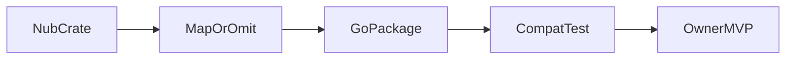

# 0083 — Cross-Cutting — Nub Rust to Mew Go Migration Map

## Document Control

| Item | Detail |
|---|---|
| Phase | Cross-Cutting |
| Primary objective | Map each Nub component and behavior to a Mew Go package, a compatibility test, a replacement design, or an intentional omission. |
| Required predecessors | 0002, 0003 |
| Primary binaries | `m`, `mx` where applicable |
| Implementation language | Go for control plane and package-manager internals; embedded JavaScript only where Node extension APIs require it |
| Status at plan creation | Planned |

## Objective

Map each Nub component and behavior to a Mew Go package, a compatibility test, a replacement design, or an intentional omission.

This MVP must be independently reviewable, testable, and releasable behind an explicit experimental gate when it changes public behavior. It must leave stable interfaces for later MVPs and avoid shortcuts that make lockfile compatibility, transactional installation, or cross-platform support impossible.

## Sequence and Dependencies

- Complete and merge 0002 before starting this MVP.
- Complete and merge 0003 before starting this MVP.

Work inside this MVP should normally follow this order:

1. Freeze behavior and data contracts with fixtures and interface tests.
2. Implement the smallest vertical path that reaches a user-visible result.
3. Add failure injection and cross-platform coverage before broadening features.
4. Measure performance and resource use before declaring the MVP complete.
5. Record intentional differences from Nub and from incumbent package managers.

## Nub Reference Mapping

- Nub crates, runtime assets, vendored Aube workspace, setup, site docs, tests, and release scripts

The Nub implementation is a behavioral reference, not a source-level porting target. Mew must preserve observable semantics where parity is intentional while selecting Go-native architecture, concurrency, storage, and error-handling patterns.

## User-Visible Surface

No new command is required in this MVP.

## In Scope

- Source tree inventory and ownership.
- Behavioral responsibilities per Rust module.
- Data formats, error codes, caches, and external protocols.
- Go replacement package and target MVP.
- Runtime JavaScript assets that remain JavaScript.
- Deprecated or product-specific Nub behavior that Mew intentionally changes.

## Explicit Non-Goals

- Do not implement features assigned to later indexed MVPs.
- Do not silently diverge from a documented compatibility contract.
- Do not optimize by weakening integrity, determinism, or crash safety.

## Architecture and Interfaces

- Do not translate files line by line.
- Port tests and invariants before or alongside implementation.
- Track source revision used for every mapping so later Nub changes can be reviewed incrementally.

Every new package must expose narrow interfaces, accept `context.Context` for cancellable work, avoid global mutable state, and return typed errors carrying stable Mew error codes. Persistent formats must be versioned and deterministic.

## Detailed Implementation Checklist

### Contracts & types

- [ ] Inventory Nub crates and runtime assets
- [ ] Mark behavioral replacements vs ports
- [ ] Note data formats and error codes
- [ ] Track gaps as research spikes when needed

### Core logic

- [ ] Inventory Aube crates
- [ ] Document deprecated Nub behaviors Mew changes
- [ ] Note caches and protocols
- [ ] No silent omissions

### CLI / UX

- [ ] Map each to Go package or omission
- [ ] Keep map synchronized with 0003
- [ ] Update when upstream Nub commit changes
- [ ] Publish human-readable migration guide outline

### Tests & fixtures

- [ ] Attach owner MVP and test ID
- [ ] Reject line-by-line ports in review
- [ ] Link sources/nub-reference-snapshot.md

### Docs & observability

- [ ] Mark JS assets that remain JS
- [ ] Cover CLI, core, native, runtime, installers
- [ ] Agent reading order includes this map

## Test Plan

<!-- ENRICHMENT-TESTS -->
- [ ] Acceptance: Every Nub crate has map/omit row
- [ ] Acceptance: Every mapped row has owner MVP
- [ ] Acceptance: Intentional omissions documented
- [ ] Fixture ready: `docs/migration/crate-map.md`
- [ ] Fixture ready: `docs/migration/omissions.md`

Required test layers:

- Unit tests for parsing, normalization, deterministic ordering, and error classification.
- Golden tests for manifests, lockfiles, command output, and migration reports.
- Integration tests against local fixture registries and isolated temporary homes.
- Failure-injection tests for network interruption, disk exhaustion, permission errors, process termination, and corrupted cache entries.
- Cross-platform tests for Linux, macOS, and Windows, including path length, case sensitivity, junctions, symlinks, and executable shims.
- Conformance tests comparing intentional compatibility surfaces with the corresponding Nub or package-manager behavior.

## Performance Requirements

- Add benchmarks for every newly introduced hot path.
- Avoid unbounded goroutines, file descriptors, memory growth, or registry requests.
- Publish baseline measurements in repository benchmark artifacts.

All performance claims must be backed by reproducible benchmark commands, machine metadata, cold/warm cache separation, and multiple samples. Performance regressions on critical paths require an explicit waiver.

## Security and Trust Requirements

- Validate all external input and fail closed on malformed or ambiguous data.
- Use least-privilege filesystem access and redact credentials in diagnostics.
- Maintain integrity verification before extraction or execution.

Secrets must never be written to logs, lockfiles, snapshots, telemetry, crash reports, or plan files. Archive extraction, script execution, registry authentication, and path construction must be treated as hostile-input boundaries.

## Risks and Mitigations

- Compatibility drift: mitigate with fixture-based conformance tests.
- Cross-platform divergence: mitigate with platform-specific CI and filesystem probes.
- Premature abstraction: require at least two concrete callers before generalizing an interface.

## Deliverables

- [ ] Production implementation and public interfaces.
- [ ] Unit, integration, conformance, and failure-injection tests.
- [ ] User documentation and migration notes where behavior is public.
- [ ] Benchmark baseline and diagnostic instrumentation.

## Exit Criteria

- [ ] All required tests pass on supported operating systems.
- [ ] No unresolved correctness, integrity, or data-loss issue remains.
- [ ] Public behavior and intentional deviations are documented.
- [ ] The next dependent MVP can consume stable interfaces without reaching into internals.

<!-- ENRICHMENT:BEGIN -->

## Feature Inventory Links

Rows this MVP owns or primarily advances (from `0002` inventory themes):

| Feature | Nub baseline | Mew target | Primary MVP |
|---|---|---|---|
| Rust→Go map | Nub crates | Go packages + tests | 0083 |
| Intentional omissions | Product | Documented | 0083 |

## Go Package Map

**Packages / paths:**

- `docs/migration/nub-to-mew.md`
- `plans/0083-rust-go-migration-map.md`

**Forbidden import edges:**

- Do not transliterate Rust modules into Go packages blindly

## Data Flow

## Commands and Flags

N/A — migration inventory.

## Persistent Artifacts

| Artifact | Purpose |
|---|---|
| Per-crate mapping table | Ownership |
| Omission list | Product decisions |

## Concrete Test Fixtures

- `docs/migration/crate-map.md`
- `docs/migration/omissions.md`

## Acceptance Scenarios

1. Every Nub crate has map/omit row
2. Every mapped row has owner MVP
3. Intentional omissions documented

## Nub Conformance Targets

- Architecture mapping | divergence

## Open Decisions

- How often to refresh against upstream Nub

<!-- ENRICHMENT:END -->

## AI-Agent Handoff Contract

- Read 0000, 0003, 0005, 0007, 0008, and the immediate predecessor before changing code.
- Prefer small vertical pull requests over broad mechanical ports.
- Never copy Rust architecture blindly; preserve behavior and invariants using idiomatic Go.
- Update the feature matrix and conformance inventory when behavior changes.

Before submitting work, an agent must provide:

1. A concise behavior summary and the exact compatibility target.
2. A list of files and public interfaces changed.
3. Commands used for tests, benchmarks, and static analysis.
4. Known gaps, deferred cases, and platform limitations.
5. Evidence that generated files and fixtures are deterministic.
6. A rollback note for any persistent-format or migration change.

## Migration Classification Rules

| Classification | Required action |
|---|---|
| Behavior port | Write Go behavior and differential/conformance tests; source structure may differ. |
| Format compatibility | Implement independent reader/writer adapter with golden fixtures and target-tool validation. |
| Protocol compatibility | Preserve observable wire or process protocol and version it explicitly. |
| Test port | Translate the invariant and fixture, not only the original assertion syntax. |
| Embedded asset rewrite | Keep Node-required JavaScript minimal, audited, embedded, and digest verified. |
| Mew extension | Add a product ADR, feature inventory row, security review, and independent tests. |
| Intentional omission | Document user impact, alternative, and why parity is not desired. |

The implementation team must expand the component map in `0003-target-architecture.md` into a path-level inventory pinned to the chosen Nub revision before claiming complete parity.

## Per-Component Migration Rows

| Nub / Aube component | Class | Mew package | Owner MVP | Compat test ID |
|---|---|---|---|---|
| `crates/nub-cli` | Behavior port | `cmd/m`, `cmd/mx`, `internal/cli`, `internal/app` | 0010 | `conf/cli-dispatch` |
| `crates/nub-core` project/workspace | Behavior port | `internal/project`, `internal/workspace` | 0011, 0022 | `conf/project-discover` |
| `crates/nub-core` scripts | Behavior port | `internal/runner` | 0040-0042 | `conf/scripts-env` |
| `crates/nub-core` node | Behavior port | `internal/node` | 0060 | `conf/node-select` |
| `aube-manifest` | Behavior port | `internal/manifest` | 0011 | `conf/manifest-edit` |
| `aube-registry` | Protocol compatibility | `internal/registry` | 0012 | `conf/registry-meta` |
| `aube-resolver` | Behavior port | `internal/resolver` | 0013, 0020 | `conf/resolve-graph` |
| `aube-lockfile` | Format compatibility | `internal/lockfile` + adapters | 0015, 0023-0025 | `conf/lock-*` |
| `aube-store` | Behavior port | `internal/store` | 0018 | `conf/store-cas` |
| `aube-linker` | Behavior port | `internal/linker` | 0016, 0019 | `conf/layout-*` |
| `aube-scripts` | Behavior port | `internal/lifecycle`, `internal/policy` | 0021 | `conf/lifecycle` |
| `crates/nub-native` | Embedded asset rewrite / divergence | `internal/transform` + JS bridge | 0051-0052 | `conf/transform-ts` |
| `runtime/*.mjs|cjs` | Embedded asset rewrite | `internal/runtime/assets` | 0050, 0053-0054 | `conf/runtime-loader` |
| `nubx` / dlx | Behavior port | `cmd/mx`, `internal/runner` | 0044 | `conf/mx-consent` |
| installers / Action / Docker | Behavior port | `install/`, `.github/actions/`, `docker/` | 0072-0074 | `conf/dist-*` |
| `nub-phantom-*` | Intentional defer / future | `internal/analysis/phantom` | 0090 | n/a until promoted |
| Direct `m <script>` | Mew extension | `internal/cli` + runner | 0042 | `conf/script-shortcut` |
| Transactions / rollback | Mew extension | `internal/transaction` | 0017, 0028 | `conf/tx-rollback` |
| Smart FS planner | Mew extension | `internal/linker/planner` | 0018 | `conf/fs-planner` |
