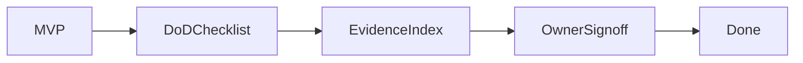

# 0087 — Cross-Cutting — Global Definition of Done

## Document Control

| Item | Detail |
|---|---|
| Phase | Cross-Cutting |
| Primary objective | Define the non-negotiable completion standard applied to every MVP and the final program. |
| Required predecessors | 0009, 0080, 0081, 0082, 0084 |
| Primary binaries | `m`, `mx` where applicable |
| Implementation language | Go for control plane and package-manager internals; embedded JavaScript only where Node extension APIs require it |
| Status at plan creation | Planned |

## Objective

Define the non-negotiable completion standard applied to every MVP and the final program.

This MVP must be independently reviewable, testable, and releasable behind an explicit experimental gate when it changes public behavior. It must leave stable interfaces for later MVPs and avoid shortcuts that make lockfile compatibility, transactional installation, or cross-platform support impossible.

## Sequence and Dependencies

- Complete and merge 0009 before starting this MVP.
- Complete and merge 0080 before starting this MVP.
- Complete and merge 0081 before starting this MVP.
- Complete and merge 0082 before starting this MVP.
- Complete and merge 0084 before starting this MVP.

Work inside this MVP should normally follow this order:

1. Freeze behavior and data contracts with fixtures and interface tests.
2. Implement the smallest vertical path that reaches a user-visible result.
3. Add failure injection and cross-platform coverage before broadening features.
4. Measure performance and resource use before declaring the MVP complete.
5. Record intentional differences from Nub and from incumbent package managers.

## Nub Reference Mapping

- Nub quality and compatibility discipline

The Nub implementation is a behavioral reference, not a source-level porting target. Mew must preserve observable semantics where parity is intentional while selecting Go-native architecture, concurrency, storage, and error-handling patterns.

## User-Visible Surface

No new command is required in this MVP.

## In Scope

- Behavior, interfaces, tests, docs, security, performance, compatibility, migration, recovery, and support.
- Release artifacts and upgrade paths.
- Known-limitations disclosure.
- Feature inventory and conformance updates.

## Explicit Non-Goals

- Do not implement features assigned to later indexed MVPs.
- Do not silently diverge from a documented compatibility contract.
- Do not optimize by weakening integrity, determinism, or crash safety.

## Architecture and Interfaces

- An MVP is not done when code compiles; it is done when its exit criteria are evidenced and dependent MVPs can rely on it.

Every new package must expose narrow interfaces, accept `context.Context` for cancellable work, avoid global mutable state, and return typed errors carrying stable Mew error codes. Persistent formats must be versioned and deterministic.

## Detailed Implementation Checklist

### Contracts & types

- [ ] Create review checklist covering behavior/interfaces/tests/docs/security/perf/compat/migration/recovery
- [ ] Audit three completed MVPs against checklist (when available)
- [ ] Conformance links required
- [ ] Document support expectations

### Core logic

- [ ] Create evidence index template
- [ ] CI fails expired waivers
- [ ] No open critical integrity issues
- [ ] Link 0080/0081/0082/0084

### CLI / UX

- [ ] Exception/waiver process with expiry
- [ ] Final program exit criteria from 0087 plan
- [ ] Release artifacts reproducible
- [ ] Publish DoD in docs/

### Tests & fixtures

- [ ] Owner sign-off for persistent format changes
- [ ] Known-limitations disclosure required
- [ ] Align stabilization gates

### Docs & observability

- [ ] Owner sign-off for security boundary changes
- [ ] Feature inventory updated before Done
- [ ] Agent cannot mark Done without evidence

## Test Plan

<!-- ENRICHMENT-TESTS -->
- [ ] Acceptance: DoD checklist exists and is used
- [ ] Acceptance: Waivers expire automatically in policy
- [ ] Acceptance: Format/security changes need owner sign-off
- [ ] Fixture ready: `docs/definition-of-done.md`
- [ ] Fixture ready: `docs/waivers/README.md`

Required test layers:

- Unit tests for parsing, normalization, deterministic ordering, and error classification.
- Golden tests for manifests, lockfiles, command output, and migration reports.
- Integration tests against local fixture registries and isolated temporary homes.
- Failure-injection tests for network interruption, disk exhaustion, permission errors, process termination, and corrupted cache entries.
- Cross-platform tests for Linux, macOS, and Windows, including path length, case sensitivity, junctions, symlinks, and executable shims.
- Conformance tests comparing intentional compatibility surfaces with the corresponding Nub or package-manager behavior.

## Performance Requirements

- Add benchmarks for every newly introduced hot path.
- Avoid unbounded goroutines, file descriptors, memory growth, or registry requests.
- Publish baseline measurements in repository benchmark artifacts.

All performance claims must be backed by reproducible benchmark commands, machine metadata, cold/warm cache separation, and multiple samples. Performance regressions on critical paths require an explicit waiver.

## Security and Trust Requirements

- Validate all external input and fail closed on malformed or ambiguous data.
- Use least-privilege filesystem access and redact credentials in diagnostics.
- Maintain integrity verification before extraction or execution.

Secrets must never be written to logs, lockfiles, snapshots, telemetry, crash reports, or plan files. Archive extraction, script execution, registry authentication, and path construction must be treated as hostile-input boundaries.

## Risks and Mitigations

- Compatibility drift: mitigate with fixture-based conformance tests.
- Cross-platform divergence: mitigate with platform-specific CI and filesystem probes.
- Premature abstraction: require at least two concrete callers before generalizing an interface.

## Deliverables

- [ ] Production implementation and public interfaces.
- [ ] Unit, integration, conformance, and failure-injection tests.
- [ ] User documentation and migration notes where behavior is public.
- [ ] Benchmark baseline and diagnostic instrumentation.

## Exit Criteria

- [ ] All planned feature inventory rows are shipped, intentionally omitted, or moved to an approved future backlog.
- [ ] All supported compatibility targets pass certification.
- [ ] All public formats have tested upgrade, recovery, and rollback paths.
- [ ] No open critical security or data-integrity issue.
- [ ] Release and installation channels are reproducible and verified.

<!-- ENRICHMENT:BEGIN -->

## Feature Inventory Links

Rows this MVP owns or primarily advances (from `0002` inventory themes):

| Feature | Nub baseline | Mew target | Primary MVP |
|---|---|---|---|
| Definition of done | Quality | Non-negotiable MVP completion | 0087 |

## Go Package Map

**Packages / paths:**

- `docs/definition-of-done.md`
- `docs/waivers/`

**Forbidden import edges:**

- None beyond architecture rules in 0003 / AGENTS.md.

## Data Flow

## Commands and Flags

N/A — quality gate. Waivers expire in CI.

## Persistent Artifacts

| Artifact | Purpose |
|---|---|
| DoD checklist | Reviews |
| Evidence index | Links tests/benches/docs |
| Waivers | Expiring exceptions |

## Concrete Test Fixtures

- `docs/definition-of-done.md`
- `docs/waivers/README.md`

## Acceptance Scenarios

1. DoD checklist exists and is used
2. Waivers expire automatically in policy
3. Format/security changes need owner sign-off

## Nub Conformance Targets

- Quality bar | extension

## Open Decisions

- Who the default owners are per subsystem

<!-- ENRICHMENT:END -->

## AI-Agent Handoff Contract

- Read 0000, 0003, 0005, 0007, 0008, and the immediate predecessor before changing code.
- Prefer small vertical pull requests over broad mechanical ports.
- Never copy Rust architecture blindly; preserve behavior and invariants using idiomatic Go.
- Update the feature matrix and conformance inventory when behavior changes.

Before submitting work, an agent must provide:

1. A concise behavior summary and the exact compatibility target.
2. A list of files and public interfaces changed.
3. Commands used for tests, benchmarks, and static analysis.
4. Known gaps, deferred cases, and platform limitations.
5. Evidence that generated files and fixtures are deterministic.
6. A rollback note for any persistent-format or migration change.
