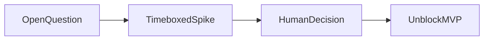

# 0089 — Open Research Spikes and Decision Gates

## Document Control

| Item | Detail |
|---|---|
| Phase | Cross-Cutting |
| Primary objective | Resolve architecture questions that could invalidate later implementation before those MVPs freeze public contracts. |
| Required predecessors | 0003, 0085 |
| Primary binaries | `m`, `mx` where applicable |
| Implementation language | Go for control plane and package-manager internals; embedded JavaScript only where Node extension APIs require it |
| Status at plan creation | Planned |

## Objective

Resolve architecture questions that could invalidate later implementation before those MVPs freeze public contracts.

This MVP must be independently reviewable, testable, and releasable behind an explicit experimental gate when it changes public behavior. It must leave stable interfaces for later MVPs and avoid shortcuts that make lockfile compatibility, transactional installation, or cross-platform support impossible.

## Sequence and Dependencies

- Complete and merge 0003 before starting this MVP.
- Complete and merge 0085 before starting this MVP.

Work inside this MVP should normally follow this order:

1. Freeze behavior and data contracts with fixtures and interface tests.
2. Implement the smallest vertical path that reaches a user-visible result.
3. Add failure injection and cross-platform coverage before broadening features.
4. Measure performance and resource use before declaring the MVP complete.
5. Record intentional differences from Nub and from incumbent package managers.

## Nub Reference Mapping

- Nub native OXC addon, Yarn PnP work, sandbox behavior, and filesystem optimizations

The Nub implementation is a behavioral reference, not a source-level porting target. Mew must preserve observable semantics where parity is intentional while selecting Go-native architecture, concurrency, storage, and error-handling patterns.

## User-Visible Surface

No new command is required in this MVP.

## In Scope

- Synchronous Node loader to Go transform-service protocol.
- Decorator metadata parity with Go transform libraries.
- Yarn Berry writer and PnP artifact generation.
- Cross-platform lifecycle sandbox capability matrix.
- Reflink/clone strategy across filesystems.
- Windows atomic project commit and locked-directory behavior.
- Credential storage and OS keyring integration.
- Portable capsule compatibility boundaries.

## Explicit Non-Goals

- Do not implement features assigned to later indexed MVPs.
- Do not silently diverge from a documented compatibility contract.
- Do not optimize by weakening integrity, determinism, or crash safety.

## Architecture and Interfaces

- Each spike has a time-boxed prototype, benchmark, threat review, alternatives, and explicit decision record.
- No spike is considered complete with only a design opinion.

Every new package must expose narrow interfaces, accept `context.Context` for cancellable work, avoid global mutable state, and return typed errors carrying stable Mew error codes. Persistent formats must be versioned and deterministic.

## Detailed Implementation Checklist

### Contracts & types

- [ ] List spikes that can invalidate later contracts
- [ ] Yarn PnP write certification spike linked to 0025
- [ ] Update Open Decisions in affected MVPs
- [ ] Link to 0009 stop-the-line when needed

### Core logic

- [ ] Timebox each spike
- [ ] Reflink reliability spike linked to 0018
- [ ] Archive spike evidence
- [ ] Do not expand critical path casually

### CLI / UX

- [ ] Require written decision outcome
- [ ] Sandbox capability matrix spike linked to 0021
- [ ] Prevent starting dependent MVP until gate cleared
- [ ] Publish spike index

### Tests & fixtures

- [ ] Decorator metadata spike linked to 0052
- [ ] No production code from spike unless promoted
- [ ] Agent protocol for spike threads

### Docs & observability

- [ ] Transform IPC vs in-process spike linked to 0051
- [ ] Human-owned decisions surfaced
- [ ] Keep backlog of resolved spikes

## Test Plan

<!-- ENRICHMENT-TESTS -->
- [ ] Acceptance: Open spikes listed with owners and due dates
- [ ] Acceptance: Blocking spikes prevent dependent MVP start
- [ ] Acceptance: Resolved spikes recorded with decisions
- [ ] Fixture ready: `docs/spikes/index.md`
- [ ] Fixture ready: `docs/spikes/TEMPLATE.md`

Required test layers:

- Unit tests for parsing, normalization, deterministic ordering, and error classification.
- Golden tests for manifests, lockfiles, command output, and migration reports.
- Integration tests against local fixture registries and isolated temporary homes.
- Failure-injection tests for network interruption, disk exhaustion, permission errors, process termination, and corrupted cache entries.
- Cross-platform tests for Linux, macOS, and Windows, including path length, case sensitivity, junctions, symlinks, and executable shims.
- Conformance tests comparing intentional compatibility surfaces with the corresponding Nub or package-manager behavior.

## Performance Requirements

- Add benchmarks for every newly introduced hot path.
- Avoid unbounded goroutines, file descriptors, memory growth, or registry requests.
- Publish baseline measurements in repository benchmark artifacts.

All performance claims must be backed by reproducible benchmark commands, machine metadata, cold/warm cache separation, and multiple samples. Performance regressions on critical paths require an explicit waiver.

## Security and Trust Requirements

- Validate all external input and fail closed on malformed or ambiguous data.
- Use least-privilege filesystem access and redact credentials in diagnostics.
- Maintain integrity verification before extraction or execution.

Secrets must never be written to logs, lockfiles, snapshots, telemetry, crash reports, or plan files. Archive extraction, script execution, registry authentication, and path construction must be treated as hostile-input boundaries.

## Risks and Mitigations

- Compatibility drift: mitigate with fixture-based conformance tests.
- Cross-platform divergence: mitigate with platform-specific CI and filesystem probes.
- Premature abstraction: require at least two concrete callers before generalizing an interface.

## Deliverables

- [ ] Production implementation and public interfaces.
- [ ] Unit, integration, conformance, and failure-injection tests.
- [ ] User documentation and migration notes where behavior is public.
- [ ] Benchmark baseline and diagnostic instrumentation.

## Exit Criteria

- [ ] All required tests pass on supported operating systems.
- [ ] No unresolved correctness, integrity, or data-loss issue remains.
- [ ] Public behavior and intentional deviations are documented.
- [ ] The next dependent MVP can consume stable interfaces without reaching into internals.

<!-- ENRICHMENT:BEGIN -->

## Feature Inventory Links

Rows this MVP owns or primarily advances (from `0002` inventory themes):

| Feature | Nub baseline | Mew target | Primary MVP |
|---|---|---|---|
| Research spikes | Architecture risks | Decision gates before freeze | 0089 |

## Go Package Map

**Packages / paths:**

- `docs/spikes/`
- `.agents/threads/`

**Forbidden import edges:**

- None beyond architecture rules in 0003 / AGENTS.md.

## Data Flow

## Commands and Flags

N/A — research. Spikes may produce throwaway probes only.

## Persistent Artifacts

| Artifact | Purpose |
|---|---|
| Spike reports | Decisions |
| Throwaway probes | Evidence |

## Concrete Test Fixtures

- `docs/spikes/index.md`
- `docs/spikes/TEMPLATE.md`

## Acceptance Scenarios

1. Open spikes listed with owners and due dates
2. Blocking spikes prevent dependent MVP start
3. Resolved spikes recorded with decisions

## Nub Conformance Targets

- Decision gates | extension

## Open Decisions

- Prioritize which spike runs first pre-0010

<!-- ENRICHMENT:END -->

## AI-Agent Handoff Contract

- Read 0000, 0003, 0005, 0007, 0008, and the immediate predecessor before changing code.
- Prefer small vertical pull requests over broad mechanical ports.
- Never copy Rust architecture blindly; preserve behavior and invariants using idiomatic Go.
- Update the feature matrix and conformance inventory when behavior changes.

Before submitting work, an agent must provide:

1. A concise behavior summary and the exact compatibility target.
2. A list of files and public interfaces changed.
3. Commands used for tests, benchmarks, and static analysis.
4. Known gaps, deferred cases, and platform limitations.
5. Evidence that generated files and fixtures are deterministic.
6. A rollback note for any persistent-format or migration change.
