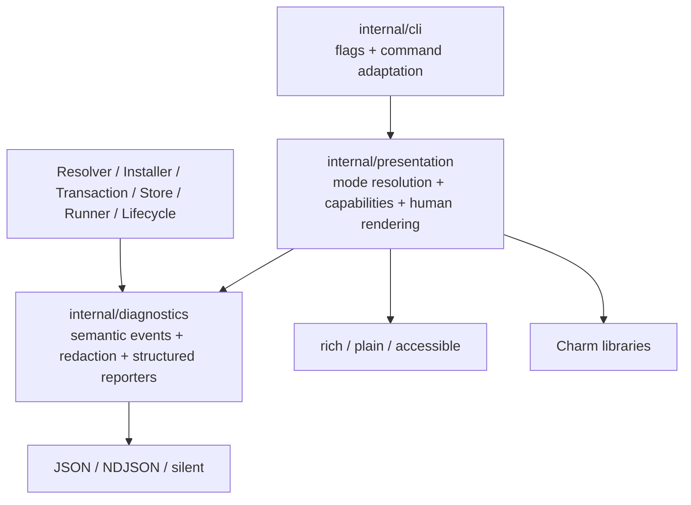

# UX-0001 — CLI Presentation Contract and Architecture

## Goal

Create the architectural and behavioral foundation for a modern Mew CLI while preserving every machine-facing and execution-facing contract.

This plan does **not** primarily add visual polish. It defines the boundary that later plans must obey so that styling, progress, prompts, and live terminal rendering cannot corrupt command results, automation, child processes, transactions, or structured output.

## User-visible outcome

After this plan, commands may still look mostly unchanged, but all command output must resolve through a consistent mode and stream policy.

Proposed global surface:

```text
--output auto|rich|plain|json|ndjson|silent
--color auto|always|never
--progress auto|always|never
--unicode auto|always|never
--interactive auto|always|never
--log-level error|warn|info|debug
--no-summary
--accessible
```

Existing command-specific `--json`, `--ndjson`, `--silent`, `--debug`, and color flags remain compatible. They become aliases or inputs to the unified resolver rather than independent rendering implementations.

## Explicitly out of scope

- Full-screen TUI dashboards.
- Alternate-screen install or execution views.
- Interactive script selection.
- Interactive package search.
- New package-manager semantics.
- New runner semantics.
- New transaction semantics.
- Reformatting JSON or NDJSON without a versioned schema change.
- Moving Charm dependencies into resolver, installer, transaction, runner, store, linker, or lifecycle domain packages.
- Theme marketplace or arbitrary user-provided style code.

## Current-state assumptions to verify

The implementation agent must confirm these statements against current code before editing:

- `internal/diagnostics` owns reporter abstractions and redaction.
- Human, JSON, NDJSON, and silent reporter modes exist.
- Progress and workspace events are already semantic enough to extend rather than replace.
- Human output is partially centralized but commands still contain direct `fmt.Fprint*`, Cobra output, table construction, or prompt output.
- Child output has explicit stdout/stderr routing in runner-related code.
- Cobra root commands silence automatic usage/error printing and route errors through Mew logic.

Any mismatch becomes a plan note and must not be silently papered over.

## Product principles

### Pretty when human, predictable when automated

- Interactive terminal: rich output when safe.
- Redirected output: plain append-only output.
- CI: plain append-only output unless explicitly overridden.
- JSON: one command-result document according to the command contract.
- NDJSON: one structured event per line.
- Silent: suppress progress and summaries while preserving required result/error behavior.

### Semantics before styling

Product packages emit typed facts:

- operation started;
- operation advanced;
- operation completed;
- package changed;
- warning raised;
- child output received;
- task state changed;
- transaction committed or rolled back;
- environment prepared.

They do not emit:

- spinner frames;
- ANSI escapes;
- padding;
- borders;
- terminal cursor commands;
- color names;
- Lip Gloss styles;
- Bubble Tea messages.

### Output must remain composable

Examples that must stay clean:

```sh
m view react version > version.txt
m ls --json | jq .
m exec eslint . 2>mew-diagnostics.log
m conformance run runner --json >report.json
```

## Architecture



### Required dependency direction

```text
internal/cli
  -> internal/presentation
  -> internal/diagnostics

product/domain packages
  -> internal/diagnostics

internal/presentation
  -> Charm libraries
```

### Forbidden edges

```text
internal/app         -> internal/presentation
internal/app         -> charm.land/*
internal/runner      -> charm.land/*
internal/transaction -> charm.land/*
internal/resolver    -> charm.land/*
internal/linker      -> charm.land/*
internal/store       -> charm.land/*
internal/lifecycle   -> charm.land/*
```

A required architecture test must enforce these boundaries through `go list -deps -json`, `go/packages`, or the repository's existing import-boundary utility.

## Package layout

Proposed initial layout:

```text
internal/presentation/
  contract.go
  options.go
  resolve.go
  capabilities.go
  controller.go
  clock.go
  writer.go
  lifecycle.go
  testkit/

internal/diagnostics/
  event.go
  reporter.go
  human_adapter.go     # temporary bridge during migration
  json.go
  ndjson.go
  redact.go
```

Later plans may add `theme`, `plain`, `human`, `live`, `prompt`, and `help` subpackages.

## Output-mode contract

### Canonical modes

```go
type OutputMode string

const (
    OutputAuto   OutputMode = "auto"
    OutputRich   OutputMode = "rich"
    OutputPlain  OutputMode = "plain"
    OutputJSON   OutputMode = "json"
    OutputNDJSON OutputMode = "ndjson"
    OutputSilent OutputMode = "silent"
)
```

Unknown modes return a typed usage/configuration error before product work begins.

### Auto resolution

`auto` resolves once per invocation using an immutable capability snapshot.

Recommended policy:

1. Explicit CLI output flag.
2. Compatible legacy flags such as `--json`.
3. `MEW_OUTPUT`.
4. effective `ui.output` config.
5. structured command requirement, if the command contract mandates it.
6. rich only when stderr is an interactive terminal, CI is false, terminal is not dumb, accessibility does not require append-only output, and the command is compatible with a live renderer.
7. otherwise plain.

Do not re-resolve mode in subcommands or after product execution starts.

### Legacy flag compatibility

- `--json` is equivalent to `--output=json` unless the command defines a separate historical JSON result flag that must remain command-local.
- `--ndjson` is equivalent to `--output=ndjson` where already supported.
- `--silent` maps to `--output=silent` or the existing semantic equivalent.
- conflicting output flags return usage error; do not use last-flag-wins behavior.

A compatibility table must list every existing command-local structured-output flag and its migration treatment.

## Stream ownership contract

### Standard output

Stdout is reserved for:

- command result data;
- generated content explicitly requested by the command;
- JSON or NDJSON machine output;
- child stdout;
- data intended for pipelines.

### Standard error

Stderr is reserved for:

- human progress;
- spinners and live status;
- notices and warnings;
- human-readable errors;
- debug diagnostics;
- non-data summaries;
- command hints.

### Prohibited behavior

- Never emit spinner frames to stdout.
- Never write human notices into JSON stdout.
- Never merge child stderr into stdout unless an existing command contract explicitly does so.
- Never add prefixes to single-task raw child output unless the existing output mode requires it.
- Never allow a rich renderer to own child stdin while an interactive child is running.

## Exit-code contract

Presentation is not allowed to reinterpret product outcomes.

- Existing `ERR_M_*` mapping remains authoritative.
- Child exit codes and signal mappings remain unchanged.
- Reporter/rendering failure follows the existing typed I/O/reporting policy.
- A fatal output error before child start prevents child start.
- A progress-render failure during a product operation must follow a locked policy: either fail the command immediately or downgrade to plain. The selected policy must be consistent and tested.
- Broken-pipe behavior must remain compatible with repository conventions.

## Redaction contract

All human and machine output continues using the existing redaction boundary.

Presentation code must not receive unredacted secrets unless needed for an explicitly unsafe debug path already supported by policy.

Redact at least:

- registry credentials;
- bearer tokens;
- authenticated URLs;
- authorization headers;
- sensitive environment values;
- temporary secret paths when required;
- child environment values not intended for output.

A new component must not bypass `diagnostics.Redact` by formatting raw domain structures directly.

## Semantic event extensions

Add typed events only where current events cannot express a stable user-facing fact.

Recommended event families:

```go
type OperationStartedEvent struct {
    V       int
    ID      string
    Kind    string
    Label   string
    Total   *int64
    Unit    string
}

type OperationProgressEvent struct {
    V         int
    ID        string
    Completed int64
    Total     *int64
    Detail    string
}

type OperationCompletedEvent struct {
    V          int
    ID         string
    Status     string
    DurationMs int64
    Metrics    []Metric
}

type NoticeEvent struct {
    V        int
    Severity string
    Code     string
    Message  string
    Hint     string
}
```

Rules:

- Event version is explicit.
- IDs are stable within one invocation.
- Ordering is deterministic where product semantics allow.
- Metrics use typed numeric fields, not preformatted strings.
- Machine reporters ignore unsupported optional events only according to version policy.
- Do not put terminal width or style in events.

## Presentation controller lifecycle

Define a controller that owns renderer startup and shutdown:

```go
type Controller interface {
    Reporter() diagnostics.Reporter
    Mode() OutputMode
    Capabilities() Capabilities
    Suspend(ctx context.Context) error
    Resume(ctx context.Context) error
    Close(ctx context.Context, outcome Outcome) error
}
```

Requirements:

- `Close` is idempotent.
- Cursor restoration and live-render cleanup happen on success, failure, cancellation, panic recovery at the CLI boundary, and broken pipe.
- `Suspend` is used before handing terminal ownership to an interactive child.
- No renderer goroutine may outlive command completion.
- Cleanup uses a bounded independent context.
- Primary product errors remain primary; cleanup errors are attached diagnostics unless repository policy says otherwise.

## Configuration and environment

Proposed keys:

```text
ui.output
ui.color
ui.progress
ui.unicode
ui.interactive
ui.accessible
ui.summary
ui.theme
log.level
```

Proposed environment variables:

```text
MEW_OUTPUT
MEW_COLOR
MEW_PROGRESS
MEW_UNICODE
MEW_INTERACTIVE
MEW_ACCESSIBLE
MEW_LOG_LEVEL
```

Also honor conventional variables where compatible:

```text
NO_COLOR
CLICOLOR
CLICOLOR_FORCE
TERM
CI
```

Precedence must be implemented in one resolver and documented. Commands must not inspect these independently.

## Charm dependency boundary

This plan authorizes a dependency evaluation, not unconditional adoption of all libraries.

Evaluate:

```text
charm.land/lipgloss/v2
charm.land/bubbletea/v2
charm.land/bubbles/v2
charm.land/huh/v2
```

Record:

- exact pinned version;
- license;
- transitive dependencies;
- CVE/security review;
- binary-size delta;
- cold startup delta;
- supported Go version;
- supported operating systems;
- update cadence;
- API stability;
- fallback strategy.

Only Lip Gloss is expected in the earliest implementation. Bubble Tea, Bubbles, and Huh are introduced by later plans after boundaries are certified.

## Migration strategy

### Inventory

Generate an inventory of every output site:

- direct `fmt.Print*` and `fmt.Fprint*`;
- Cobra `Print*` calls;
- table renderers;
- progress reporters;
- prompt writes;
- debug lines;
- child-output writes;
- JSON encoders;
- NDJSON encoders;
- help templates;
- pager calls;
- terminal-size queries;
- raw ANSI strings.

Each site is classified:

```text
result | progress | warning | error | debug | child-stdout | child-stderr | prompt | help | machine-output
```

### Compatibility bridge

During migration, existing `diagnostics.Reporter` continues to work.

A temporary human adapter may translate existing events into the new presentation controller. It must be deleted or explicitly retained by the final certification plan.

### Rollback switch

Add a temporary hidden or experimental switch that forces legacy/plain presentation during rollout. It is not a permanent public feature.

The switch must:

- preserve machine output;
- be available in CI for bisecting regressions;
- have an explicit removal milestone in UX-0008.

## Implementation phases

### Phase 1 — Audit and contract matrix

Deliver:

- output-site inventory;
- stream ownership table;
- existing flag compatibility table;
- command classification: static, progress, child-process, prompt, structured-only;
- current JSON/NDJSON schema inventory;
- known Windows and TTY constraints.

### Phase 2 — Core types and resolver

Implement:

- output-mode types;
- color/progress/unicode/interactive tri-state types;
- immutable resolved options;
- environment/config/CLI precedence;
- conflict validation;
- test fixtures for TTY, CI, environment, and config combinations.

### Phase 3 — Controller and adapter

Implement:

- controller lifecycle;
- existing reporter adapter;
- plain fallback;
- shutdown and cancellation handling;
- stream-safe writers;
- renderer suspension hooks.

### Phase 4 — Event contract additions

Add only events required by later plans. Update JSON/NDJSON policy deliberately and version schemas when necessary.

### Phase 5 — Architecture and compatibility tests

Add import-boundary, stream, redaction, output-mode, and lifecycle tests.

## Error table

| Case | Required behavior |
|---|---|
| Invalid output mode | typed usage/config error before command execution |
| Conflicting structured flags | typed usage error |
| Rich mode requested on unsupported terminal | deterministic downgrade or explicit unsupported error according to locked policy |
| JSON reporter creation failure | typed I/O/internal error; no product execution |
| Renderer startup failure in auto mode | downgrade to plain with debug diagnostic |
| Renderer startup failure in forced rich mode | typed I/O error |
| Renderer close failure | primary error wins; close error attached unless no primary error exists |
| Broken pipe | existing broken-pipe mapping; bounded cleanup |
| Parent cancellation | existing cancellation mapping; renderer stopped |
| Secret found in human snapshot | test failure |
| Domain imports Charm | architecture test failure |

## Testing

### Unit tests

- all precedence combinations;
- conflicting flags;
- mode resolution with TTY and CI permutations;
- stream writer ownership;
- redaction of every component field;
- controller idempotent close;
- suspend/resume state machine;
- renderer failure policy;
- import-boundary checks.

### Integration tests

```sh
m version >out.txt 2>err.txt
m features --json >out.json 2>err.txt
m ls --ndjson | <validator>
m exec <fixture-bin> >child.out 2>child.err
```

Assert exact stream ownership and absence of ANSI in redirected output.

### Race tests

```sh
go test -race ./internal/diagnostics/... ./internal/presentation/... ./internal/cli/...
```

## Acceptance criteria

- One output resolver controls all global presentation behavior.
- Existing structured output remains valid.
- Existing exit mappings remain unchanged.
- Child streams remain unmodified.
- Domain packages do not import Charm or presentation packages.
- Renderer lifecycle is cancellation-safe and idempotent.
- Every direct output site is inventoried.
- Later plans can add styling without redefining output contracts.

## Risks

| Risk | Mitigation |
|---|---|
| Compatibility flags become ambiguous | explicit compatibility table and conflict tests |
| Event expansion breaks NDJSON users | versioned event policy and schema tests |
| Renderer errors mask product errors | primary-error precedence contract |
| Domain packages become presentation-aware | executable import-boundary tests |
| Stream ownership drifts command by command | centralized controller and integration matrix |
| Rollout is difficult to bisect | temporary legacy/plain fallback switch |

## Estimated effort

**12–18 focused engineering hours**, excluding fixes to unrelated output bugs discovered by the audit.

## References

- Current repository diagnostics and CLI code.
- Charm Bubble Tea v2: https://charm.land/bubbletea
- Charm v2 release overview: https://charm.land/blog/v2/
